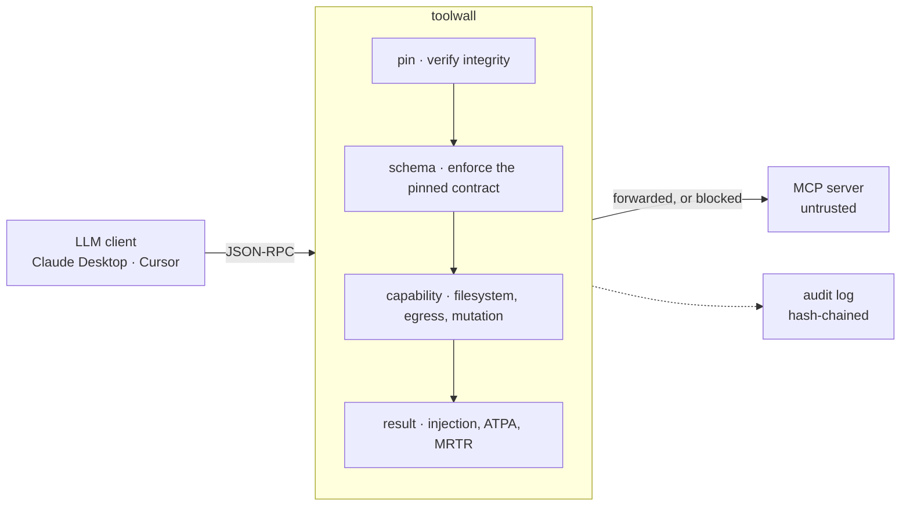

<h1 align="center">toolwall</h1>
<p align="center"><strong>A local-first guardrail proxy for MCP.</strong><br>
It sits between your LLM client and untrusted MCP servers and constrains what a tool can actually do —
then proves the tool is still the one you approved, before every call.</p>
<p align="center">
  
</p>
<p align="center"><em>Real output from the shipped binary. No configuration was written.</em></p>

---

## What it does

**Constrains capability.** A calculator that has never needed the filesystem cannot be talked into
reading one. Capability is inferred from each tool's own published schema, so this works with **no
config file** — the thing most security tools require and nobody writes.

**Proves integrity continuously.** Every tool definition is canonicalised (RFC 8785) and hashed, and
re-verified **before every call** — not once at install, not once at first connect. That is what
catches a rug pull.

**Stays out of the way.** No account, no telemetry, no network calls in the default path. Benign
traffic is forwarded untouched, by reference, with no re-serialization.



## Quickstart

```bash
git clone https://github.com/nicanor-korir/toolwall && cd toolwall
npm install && npm run build

# put toolwall in front of any MCP server
node dist/cli/index.js --server "npx -y @modelcontextprotocol/server-filesystem ~/work"
```

Then point your client at `toolwall` instead of the server directly — see
**[Getting started](docs/getting-started.md)** for Claude Desktop and Cursor config.

## Measured

Numbers are produced by the test suite, not estimated. Reproduce with `npm test`.

| | Result |
|---|---|
| Capability abuse caught, **zero config** | **16/17 (94.1%)** — 0/17 without inference |
| False positives, default tier | **0.0%** across 63 benign calls · 0.0% across 24 benign results |
| Pin-time assessment on real servers | **0/11** flagged · 0/100 tools · 11 real published MCP servers |
| Published poisoning payloads caught | 7/8 by assessment · 1/8 by the unicode rule |
| Added latency | `mean ≤ 0.70ms + 0.03ms/KiB + 0.16ms/1k nodes` |

## What it does not do

Stated plainly, because a security tool that implies more than it delivers is worse than none.

- **It is not a sandbox.** It constrains what the *model* can direct a tool to do. It cannot contain a
  server that already has code execution, and it cannot see a compromised server's own sockets.
  Run [Docker MCP Gateway](https://github.com/docker/mcp-gateway) alongside for containment.
- **Trust-on-first-use pins whatever it first sees.** If a server is already malicious the first time
  you connect, toolwall pins the poison and enforces it faithfully. The
  [pin-time assessment](docs/guards.md) is evidence for that decision, not a guarantee.
- **It does not fix vulnerable servers.** Command injection and broken auth inside MCP servers are
  ~65% of catalogued MCP CVEs and are not addressable from a proxy.
- **Heuristics are signals, not walls.** The phrase-matching approach this project started with detects
  **0 of 5** canonical published payloads — which is why it ships none. See
  [design history](docs/design-history.md).

## Documentation

| | |
|---|---|
| [Getting started](docs/getting-started.md) | Install, first run, wiring Claude Desktop and Cursor |
| [How it works](docs/how-it-works.md) | The request path, guard pipeline, reconnect gate |
| [Guards](docs/guards.md) | Every guard: what it catches, what it misses, measured rates |
| [Configuration](docs/configuration.md) | Full flag reference, policy format, strictness tiers |
| [Threat model](docs/threat-model.md) | What is defended, what is explicitly out of scope |
| [Architecture](docs/architecture.md) | Module map, core interfaces, protocol eras |
| [Decisions](docs/decisions.md) | The contract register — every rule and why it exists |
| [Performance](docs/performance.md) | The measurement story and the budget |
| [Positioning](docs/positioning.md) | Why capability leads and pinning is the substrate |
| [Research brief](docs/research-brief.md) | Verified findings on the MCP security landscape |
| [Design history](docs/design-history.md) | What changed from the original plan, and why |

## Prior art

toolwall exists because of work by others, and differs from it in specific ways rather than vaguely.
[Invariant Labs](https://invariantlabs.ai/blog/mcp-security-notification-tool-poisoning-attacks) named
tool poisoning. [Trail of Bits' `mcp-context-protector`](https://github.com/trailofbits/mcp-context-protector)
is the closest architectural prior art — it pins at first connect; toolwall re-verifies before every
call, because [Deadbugz](https://www.pillar.security/blog/deadbugz-currently-active-mcp-supply-chain-campaign)
mutates after three tool calls specifically to walk through that gap.
[Docker MCP Gateway](https://github.com/docker/mcp-gateway) does containment better than we will.

## License

MIT
