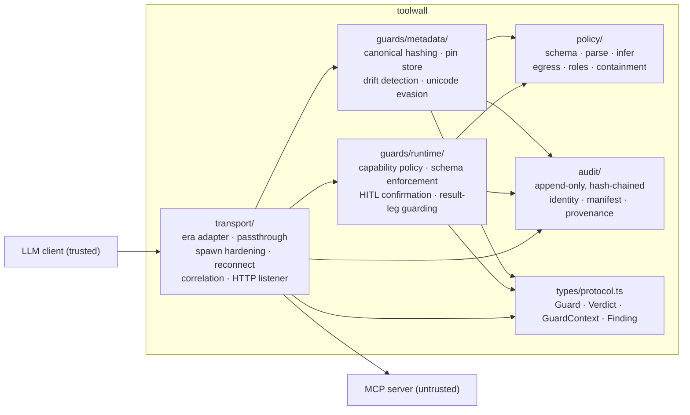
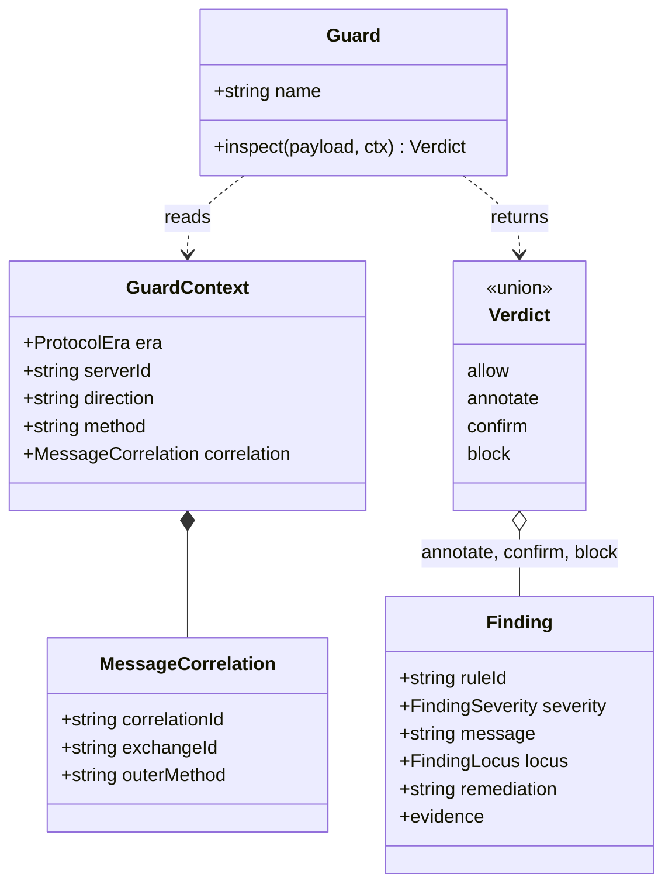
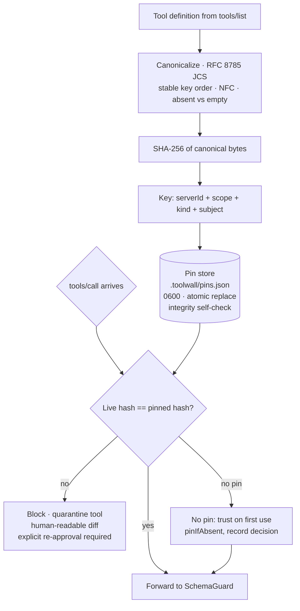
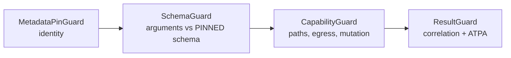
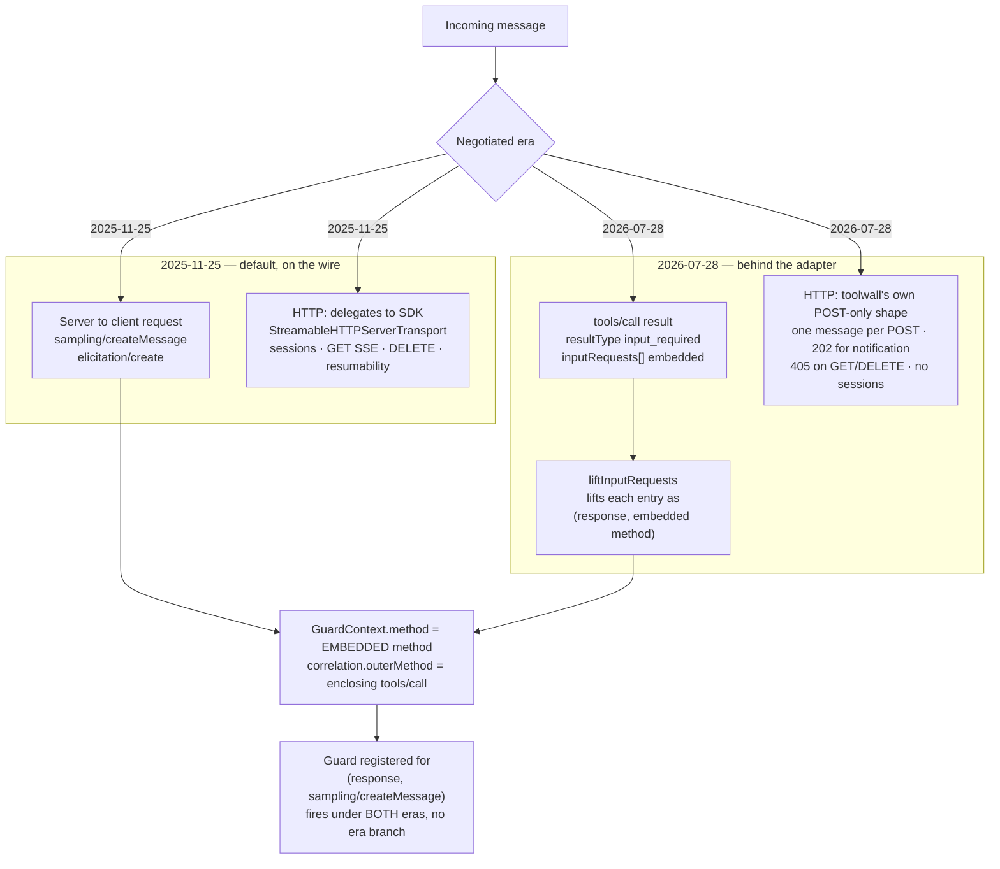

# toolwall — Architecture

Design reference for toolwall, a local-first MCP guardrail proxy. Read
`docs/research-brief.md` and `docs/threat-model.md` first; this document assumes both.

Companion documents:

- `docs/decisions.md` — the contract register (C-0 … C-29), the binding rules and the defects
  that produced them.
- `docs/performance.md` — the measurement story and the latency budget.

## Product thesis

Every other MCP security tool either scans **once, before you start** (Snyk agent-scan, Cisco
mcp-scanner) or pins **once, at first connect** (Trail of Bits `mcp-context-protector`). Pillar's
Deadbugz campaign mutates after **three tool calls**, specifically to walk through that gap.

toolwall re-verifies the cryptographic identity of a tool definition **before every single
`tools/call`** — locally, offline, with no account and no telemetry. That is the whole wedge.
Transport proxying is commodity; continuous re-verification is not.

Standing decisions:

| Decision | Choice | Rationale |
|---|---|---|
| Scope | Differentiated wedge | Transport proxying is commodity (5M dl/mo); pinning is unmet |
| Protocol | `2025-11-25` primary, era adapter | The SDK and every real client are on 2025-11-25; the published spec is 2026-07-28 |
| Detection rules | Compose `agent-threat-rules` (MIT, 85 tool-poisoning rules, TS engine) | Do not write our own regex list |
| Classifier | `@stackone/defender`, optional, off by default | Deterministic core; no LLM in the hot path |
| Canonicalization | RFC 8785 JCS + SHA-256 | Forward-compatible with SEP-3140 if it lands |

Non-negotiables:

1. No fabricated benchmarks, coverage numbers or catch rates. Run it or omit it.
2. Every detector reports a measured false-positive rate on a benign corpus.
3. Zero telemetry, no network calls in the default path. A differentiator, not a preference.
4. The out-of-scope list is stated plainly. toolwall does not imply sandbox-grade containment.
5. Prior art is credited honestly — Trail of Bits, Invariant, JanuScope — and differences stated.

## Module map



Arrows are dependency direction. `types/protocol.ts` is the only shared surface between
`transport/` and `guards/` — neither depends on the other. `guards/metadata/` and
`guards/runtime/` do not depend on each other either; they meet only through the pin store,
which `guards/runtime/` reads through the `ToolDefinitionSource` interface.

| Path | Responsibility |
|---|---|
| `src/transport/`, `src/cli/`, `src/types/protocol.ts` | Stream engine: relaying, correlation, era shape, spawn |
| `src/guards/metadata/`, `src/audit/manifest.ts` | Identity: canonicalization, hashing, pins, drift |
| `src/guards/runtime/`, `src/policy/` | Execution: capabilities, schemas, confirmation, results |
| `src/audit/` | Append-only hash-chained log, server identity, provenance |
| `src/index.ts` | `assembleToolwall()` — the only place guards are registered |

`assembleToolwall()` is the single assembly point. A guard that is not registered there does not
run, and three separate occurrences of exactly that failure are recorded in `docs/decisions.md`
(C-0, C-17, C-22). `test/integration/wiring-completeness.test.ts` now makes an unreachable module
a test failure.

## The one interface everything hangs off

```ts
export type ProtocolEra = "2025-11-25" | "2026-07-28";

export interface GuardContext {
  readonly era: ProtocolEra;
  readonly serverId: string;        // stable per-connection identity, NOT serverInfo.name
  readonly direction: "request" | "response";
  readonly method: string;
  readonly correlation?: MessageCorrelation;   // populated on every context the transport builds
}

export type Verdict =
  | { action: "allow" }
  | { action: "annotate"; payload: unknown; findings: Finding[] }   // modified, forwarded
  | { action: "confirm";  findings: Finding[] }                     // needs a human
  | { action: "block";    findings: Finding[]; code: number };      // JSON-RPC error to client

export interface Guard {
  readonly name: string;
  /** MUST be pure and synchronous where possible — this is the hot path. */
  inspect(payload: unknown, ctx: GuardContext): Verdict;
}
```



`FindingSeverity` is `info | low | medium | high | critical`. `FindingLocus` is a JSON Pointer
into the inspected payload — and therefore contains names the untrusted side chose, which is why
it is sanitized at every rendered sink (see C-14a).

Pipeline invariants, enforced by `transport/pipeline.ts`:

- A guard that **throws is treated as a block**, never an allow.
- Guards **MUST NOT mutate** the payload they receive — return `annotate` with a new value.
- Block codes in `-32020..-32099` are **rewritten to `-32600`**; that range is reserved for the
  MCP spec. Current usage is `-32602` for genuinely invalid params and
  `-32600`/`TOOLWALL_BLOCKED` for well-formed but not permitted.
- A `confirm` verdict **fails closed** until a `ConfirmationProvider` is wired. Providers MUST
  NOT write to stdout — that is the protocol channel.
- A `block` verdict can never be overridden by a transport error path.
- Any method with no registered guard is forwarded **byte-identical**, built on the SDK's
  `fallbackRequestHandler` / `fallbackNotificationHandler`. Methods are never enumerated.

Direction is defined relative to trust, not to who sent the message: `"request"` means travelling
toward the untrusted server, `"response"` means travelling toward the trusted client. A
server→client `sampling/createMessage` is therefore inspected on the **`"response"`** leg, because
it is attacker-controlled data; the client's answer to it is inspected on the `"request"` leg.

Byte-identity is bounded and the bound is documented: the SDK's stdio codec parses with zod, which
rebuilds objects with declared keys first. Raw wire bytes are identical for `initialize`,
`tools/list`, `tools/call`, unknown methods and errors. The single deviation is `_meta` hoisting
when `_meta` is not in first key position — a dedicated test asserts the raw bytes differ but are
identical post-parse, so a client cannot observe it.

## Pinning

The differentiator. A pin binds `(serverId, scope, kind, subject)` to the SHA-256 of the RFC 8785
canonical form of a tool definition — or of a server's `instructions` — together with the decision
that approved it.



Rules:

1. **Canonicalize** with RFC 8785 (JCS): stable key order, defined Unicode normalization (NFC),
   explicit absent-vs-empty handling. Covers `name`, `title`, `description`, `inputSchema`,
   `outputSchema`, `annotations`, and server `instructions`. A hash that changes on irrelevant
   reserialization is a bug that destroys user trust through false rug-pull alarms; canonicalization
   is property-tested against reserialization.
2. **Pin** `SHA-256(canonical)` under `(serverId, scope, kind, subject)` with era, first-seen,
   last-verified and the approving decision. `kind` is `"tool"` or `"server"`. `scope` is the
   authorization context the listing was obtained under, and is part of the key rather than metadata
   hanging off it.
3. **Re-verify before every `tools/call`** — not at handshake, not at first connect. This is the point.
4. **On drift**: block, quarantine, surface a diff a human can read, require explicit re-approval.
   Never auto-accept. `CVE-2025-54136` is exactly the auto-accept failure, so the store has no
   `upsert`, no `force: true` and no "same file, must be fine" shortcut. `pin()` and `pinIfAbsent()`
   can only ever create; the single function that can replace a hash is `approveDrift()`, which
   requires a `PinDecision` naming who approved it and why and files the superseded hash into
   `history`.
5. **Provenance** (opt-in): verify npm SLSA/Sigstore attestations and `server.json` `fileSha256`
   where available. Cheap, deterministic, no key, no LLM. Off by default and making zero network
   calls in the default path.

`serverId` is derived from the launch spec by one implementation in `src/audit/identity.ts`. The
rule is **structure is identity, secrets are not**: environment-variable and query-parameter NAMES
contribute, values never do, and `cwd` contributes only when the operator specified one.

Two consequences of that design are load-bearing:

- **Schema enforcement reads the pinned definition, never the live listing.** Validating arguments
  against the schema the server just sent lets an attacker widen their own schema and then send
  arguments that are now "valid". `PinnedToolDefinitionSource` is backed by `PinRecord.definition`;
  there is no fallback to the live listing. See C-1.
- **A reconnect is a new process, and `serverId` is stable across restarts by design** — so a
  routine restart does not orphan every pin. Before any buffered request is released,
  `#reverifyAfterReconnect()` marks the cached catalogue stale, replays the captured handshake so
  the new process's `instructions` are re-checked, and issues its own `tools/list` through the same
  `("response", "tools/list")` guards a client-originated listing would hit. A block there fails the
  buffer closed. See C-20 and the reconnect entries in `docs/decisions.md`.

Guard order on `tools/call` is a security decision, not a preference:



Identity first: if the definition drifted, the schema and annotations the next two guards would
read are attacker-controlled as of that moment. Capability last among the enforcing three because
it is the only one that touches the filesystem. `ResultGuard` is registered last so a call the
other guards blocked is never recorded as in flight for a result that will never arrive. The
pipeline short-circuits on the first block, so this order also makes the finding a user sees name
the most fundamental problem rather than a symptom.

## Protocol eras

The era is a runtime value, not a build target. toolwall speaks `2025-11-25` on the wire because
that is what the SDK and every shipping client implement; `2026-07-28` is the published revision
and is handled behind an adapter so it is a module rather than a rewrite.



The adapter's job is to make the era invisible to guards. `ToolwallProxy.#liftInputRequests`
inspects each `inputRequests` entry as `("response", <embedded method>)`, so the same registration
fires on the live `2025-11-25` server→client request and on the `2026-07-28` copy embedded in a
`tools/call` result. `GuardContext.method` is the embedded method; the enclosing method is
available as `correlation.outerMethod`.

Correlation carries two ids because there are two questions:

| Question | Field | Reused? |
|---|---|---|
| "Which REQUEST does this RESULT answer?" | `correlationId` | Never |
| "Which logical exchange is this, retries included?" | `exchangeId` | Yes, by an MRTR retry — that is its purpose |

`exchangeId` was never a pairing key: an `input_required` retry deliberately reuses it, so two live
messages can share one. `correlationId` is minted per round trip from a separate counter with a
different prefix (`c1`, `c2`… vs `x1`, `x2`…) so the two id spaces cannot be confused in a log.

On the HTTP side, the two eras are two implementations because the SDK forces it:
`webStandardStreamableHttp.js:174` throws *"Stateless transport cannot be reused across requests"*
the second time a transport with no `sessionIdGenerator` handles anything. The SDK's stateless mode
is one transport per HTTP request, which cannot be the client leg of a long-lived proxy session.
The stated limitation of the POST-only lane: a server→client message that is not the answer to an
in-flight POST — a relayed `notifications/message`, a `notifications/progress`, a sampling request —
has no channel, and is reported on the operator channel and dropped. Under `2025-11-25` those ride
the `GET` stream and are delivered normally.

The client-facing HTTP leg (`StreamableHttpListener`, under `--listen`) is live, with four
non-optional controls; the upstream HTTP leg is complete and proven but not yet reachable from the
CLI. See C-25 and C-26.

## Performance model

The full measurement story is in `docs/performance.md`. The design consequences:

- **Interposition is free.** A raw byte relay that parses nothing and guards nothing is flat at
  ±0.45 ms from 9 bytes to 860 KiB, with no trend. The extra process hop is not the cost.
- **The JSON codec is the cost**, and it is not toolwall's — any proxy that reads what it forwards
  pays one extra parse and one extra re-serialize per leg.
- **Response-leg cost scales with node count, not bytes.** A 64 KiB single string is about six
  nodes and walks in microseconds; 2,000 structured rows is ~12k nodes and does not.
- **The budget is a curve, not a flat number**: `added mean ≤ 0.70 ms + 0.03 ms/KiB +
  0.16 ms per 1,000 nodes`, with the constants fixed in `bench/latency.ts` and deliberately not
  refitted per run.

Design rules that follow: do not re-serialize untouched payloads, do not deep-clone large results,
and register guards per `(direction, method)` rather than with `ANY_METHOD` so `hasGuards()` stays
false for every unguarded and future method and those forward by reference with no work done on them.
