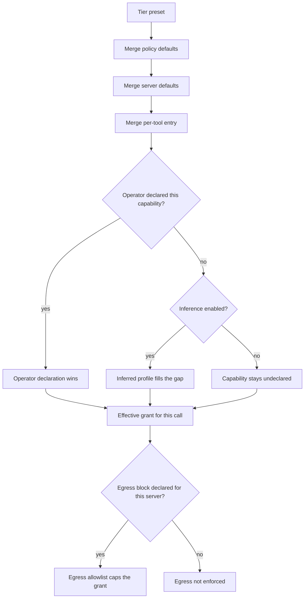

# Configuration

Three things configure toolwall, in increasing order of effort:

1. **CLI flags** — everything about how the proxy runs.
2. **The strictness tier** — one word that picks a whole posture.
3. **`toolwall-policy.json`** — per-server, per-tool capability declarations.

You need none of them to get a capability floor; see
[getting-started.md](./getting-started.md). This page is the reference.

---

## CLI reference

Two mutually exclusive forms:

```bash
toolwall --server "<command> [args...]" [options]
toolwall [options] -- <command> [args...]
```

Passing both is an error. `--server` takes one string that toolwall tokenizes itself: single quotes,
double quotes and backslash escapes are honoured so a path with a space works, but no shell syntax is
interpreted. Pipes, `&&`, `$(...)` and redirections survive as literal arguments and are then
rejected before anything is spawned.

Unknown options are a hard error, not a warning. Anything not in the table below is not accepted.

#### Every flag

| Flag | Value | Default | What it does |
|---|---|---|---|
| `--server` | command string | — | The upstream server command line, tokenized by toolwall. Mutually exclusive with `--` |
| `--` | — | — | Everything after it is the server argv, passed through unsplit |
| `--cwd` | dir | process cwd | Working directory for the spawned server, and the base for relative state paths and inferred filesystem roots |
| `--server-id` | id | derived `srv_<hex>` | Identity the pin store and the policy `servers` block key on. Without it, an id is derived by hashing command, args, cwd and env variable *names* |
| `--allow-command` | binary basename | no allowlist | Restrict the spawnable binary to this basename. Repeatable. Argument-level validation applies either way |
| `--pass-env` | `NAME` | — | Copy `NAME` from toolwall's environment into the child. Repeatable. Nothing beyond the SDK's default set is passed otherwise |
| `--era` | `2025-11-25` \| `2026-07-28` | `2025-11-25` | Protocol revision to speak. `2026-07-28` enables MRTR handling and changes the HTTP profile |
| `-v`, `--verbose` | — | off | Diagnostics on stderr. Never on stdout — under stdio that is the protocol channel |
| `-h`, `--help` | — | — | The usage text, on stderr |
| `--version` | — | — | The version, on stderr |
| **Spawn policy** | | | |
| `--allow-inline-code` | — | refused | Permit `sh -c`, `node -e`, `python -c`, `npx -c` style invocation of the *server command*. This disables the primary command-injection control |
| `--allow-privilege-pivot` | — | refused | Permit `sudo`, `su`, `env`, `ssh`, `docker` and similar as the server command |
| **Policy and enforcement** | | | |
| `--policy` | file | — | Path to `toolwall-policy.json`. Optional — inference runs without one |
| `--tier` | `permissive` \| `balanced` \| `strict` | `balanced` | Strictness tier. Ignored when `--policy` is given; the file states its own tier |
| `--no-inference` | — | inference ON | Turn OFF the inferred capability floor. The capability layer then enforces only what the policy file declares |
| `--no-guards` | — | guards ON | Bare passthrough with every guard off. For latency comparison and false-positive bisection. This turns the product off |
| `--advisory-rules` | `enforce` \| `alert` \| `hunt` | OFF | Turn on the advisory `agent-threat-rules` detector. Never blocks — matches go to stderr and the audit log. Needs the optional 9.3 MB dependency and adds roughly a second to startup |
| **Pinning** | | | |
| `--pins` | file | `.toolwall/pins.json` under `--cwd` | Where approved tool definitions live. Directory mode `0700`, file mode `0600` |
| `--pin-mode` | `tofu` \| `strict` | `tofu` | `tofu` pins the first definition it sees and enforces from then on. `strict` never pins on its own: an unapproved tool needs a human, and gets the full pin-time report |
| `--on-unverifiable` | `block` \| `confirm` \| `allow` | `confirm` | What to do with a `tools/call` that cannot be checked against a pin |
| `--audit-log` | file | none (in-memory) | Append the hash-chained audit log here as JSONL. Local file only |
| **Provenance — off unless you name one of these** | | | |
| `--verify-provenance` | — | OFF | Look up the package's npm build attestation. **The only flag that makes a network request.** It reports whether an attestation exists and who published it; it does not cryptographically verify the Sigstore bundle |
| `--provenance-registry` | url | `https://registry.npmjs.org` | Registry origin to query. `https` only |
| `--provenance-bundle` | — | OFF | Also fetch the attestation bundle to read source repo, commit and builder out of the SLSA predicate |
| `--provenance-artifact` | path | — | Local artifact (`.mcpb` or tarball) to hash against a `server.json` `fileSha256`. Offline |
| `--server-json` | path | — | A `server.json` describing this server. Its `fileSha256` is the one fully offline, deterministic check here |
| **HTTP listener** | | | |
| `--listen` | `[host:port]` | `127.0.0.1:0` | Serve the **client** leg over Streamable HTTP instead of stdio. The upstream server is still spawned over stdio. Binds loopback; a non-loopback host is accepted and loudly warned. Origin and Host are validated (403 on mismatch) and a bearer token is required on every request |
| `--listen-path` | absolute path | `/mcp` | Endpoint path. Implies `--listen` |
| `--listen-token` | ≥16 chars | generated | Bearer token clients must present. Generated when omitted, printed once on stderr, never written to disk. There is no flag to turn it off. Implies `--listen` |
| `--listen-allow-origin` | origin | loopback only | Additionally accept this exact scheme+host+port Origin. Repeatable. Loopback origins are accepted without being named. Implies `--listen` |
| **Resilience** | | | |
| `--no-reconnect` | — | reconnect ON | Do not buffer and retry when the upstream server blips; close the client session immediately |
| `--reconnect-attempts` | integer 0–100 | `3` | Attempts before the buffered requests get `-32603`. Roughly two seconds at the default |
| `--replay-in-flight` | `none` \| `read-only-methods` \| `all` | `read-only-methods` | What to do with a request already on the wire when the connection died. The default resends only listing and read methods; `all` accepts at-least-once delivery |

A reconnected server is **always** re-verified against the pin store before any buffered request is
released. That is not configurable.

### Notes on a few of them

**`--tier` is ignored when `--policy` is given.** The policy file states its own `tier`, and the file
wins. If you want a tier without a policy file, pass `--tier` and no `--policy`.

**`--listen` is opt-in and stays opt-in.** stdio is the default because that is how clients spawn
servers, and opening a port nobody asked for is the posture that CVE-2025-49596 and CVE-2026-23744
punished — both were unauthenticated local endpoints a web page could reach. When you do open one:
loopback bind, Origin/Host validation, a mandatory bearer token, and mirrored `Mcp-*` headers checked
against the JSON-RPC body (disagreement is `400` with `-32020 HeaderMismatch`). None of those can be
switched off. Under `--era 2026-07-28` the endpoint is POST-only with no sessions and no
resumability; `GET` and `DELETE` answer `405`.

**`--replay-in-flight read-only-methods` has an honest limit.** A hostile server can make
`resources/read` or `prompts/get` side-effecting, so the default accepts at-most-twice execution of
server-side-only effects. Use `none` if you do not accept that.

**`--advisory-rules` is off by default and the numbers are why.** Measured on this repo's corpora
(`test/unit/atr-fp.test.ts`, printed on every run): the `enforce` lane catches **0 of 8** published
tool-poisoning payloads at 0.0% false positives; `alert` catches **5 of 8 at 6.5% FP** on the benign
metadata corpus. Neither justifies being on by default, and the verdict is `allow` regardless of
lane — findings go to the audit log and stderr, nothing is blocked.

**Provenance says who published a package. Never that its tools are honest.** The entire code path,
including its offline half, is only constructed when you name one of the provenance flags. The
*network* half additionally requires `--verify-provenance`. Without it toolwall makes no outbound
connection of any kind.

---

## The policy file

`toolwall-policy.json` is a **capability model, not a blocklist**. It declares what each tool is
*allowed* to touch: which filesystem roots, which hosts, whether it may mutate, and what argument
shapes are in bounds. There are deliberately no character or regex blocklists on argument strings —
a code-editing tool receives shell syntax as normal business, a git tool receives `..` as git's own
range operator, a SQL tool receives semicolons.

Unknown keys are **rejected**, not ignored: a typo would silently weaken the policy.

### Top level

| Key | Type | Required | Meaning |
|---|---|---|---|
| `$schema` | string | no | Accepted and ignored, so editors can be pointed at a schema |
| `version` | `1` | **yes** | Format version. Anything else is an error |
| `tier` | `permissive` \| `balanced` \| `strict` | **yes** | The tier this file runs at. Overrides `--tier` |
| `defaults` | grant | no | Applies to every tool on every server |
| `egress` | egress | no | Egress allowlist for every server that does not declare its own |
| `response` | response | no | Response-leg controls for every server that does not declare its own |
| `confirmation` | confirmation | no | Human-in-the-loop budget. One budget per session, shared across servers |
| `servers` | object keyed by server id | no | Per-server policy |

`servers` is keyed by the **server id**, which is `--server-id` when you set one and a derived
`srv_<32 hex>` otherwise. The startup banner prints the id in use. Set `--server-id` if you want to
write a readable policy file.

### Per server

| Key | Type | Meaning |
|---|---|---|
| `defaults` | grant | Applies to every tool on this server |
| `tools` | object keyed by tool name | Per-tool grant. Presence here also marks the tool as **known** |
| `egress` | egress | Per-server egress allowlist |
| `response` | response | Per-server response-leg controls |

### Capability grants

Every field is optional; what you write is merged over the tier preset.

| Key | Type | Meaning |
|---|---|---|
| `filesystem` | object or absent | Filesystem capability. Absent means *undeclared*, which is not the same as denied — see `undeclaredCapability` |
| `filesystem.read` | string[] | Absolute directory roots this tool may read from. Canonicalized (symlinks resolved) at load time |
| `filesystem.write` | string[] | Absolute roots it may write to. Implies read on the same root |
| `filesystem.deny` | string[] | Roots carved out of the above, checked after canonicalization — e.g. `<root>/.git`, `<root>/.env` |
| `filesystem.followSymlinksOutOfRoot` | boolean | Whether a symlink resolving outside the granted roots may be followed. Present so the decision is visible, not so you would set it true |
| `filesystem.allowNonexistent` | boolean | Allow paths that do not exist yet. Required for any tool that creates files |
| `network` | object or absent | Per-tool network capability |
| `network.hosts` | string[] | `example.com` (exact, case-insensitive after URL/IDNA normalization) or `*.example.com` (strict subdomains only, **not** `example.com` itself). Never substring-matched. `*` matches everything and produces a warning |
| `network.schemes` | string[] | Allowed URL schemes, lowercase, no colon |
| `network.allowPrivateNetwork` | boolean | Whether a host matched by a **wildcard** entry may resolve to private/loopback/link-local space. An exact-host entry is an explicit grant and always wins |
| `network.allowIpLiterals` | boolean | Whether bare IPv4/IPv6 literals are acceptable hosts at all |
| `network.allowMetadataEndpoints` | boolean | Permit cloud instance-metadata endpoints and link-local space. Default `false`, including in inferred grants |
| `mutation` | `deny` \| `confirm` \| `allow` | Disposition for a call that mutates state |
| `mutates` | boolean | Your authoritative statement of whether this tool mutates. When set, server annotations are irrelevant |
| `bounds.maxTotalBytes` | integer | Structural caps on the arguments object. Cheap, deterministic, and the mitigation for oversized/deeply-nested payload attacks against the proxy itself. Not content inspection |
| `bounds.maxStringLength` | integer | |
| `bounds.maxArrayItems` | integer | |
| `bounds.maxObjectProperties` | integer | |
| `bounds.maxDepth` | integer | |
| `roles.readPath` | string[] | Selectors naming arguments the tool will READ from the filesystem |
| `roles.writePath` | string[] | Selectors naming arguments it will WRITE, delete or move |
| `roles.url` | string[] | Selectors carrying a full URL |
| `roles.host` | string[] | Selectors carrying a bare host (`api.example.com`, `10.0.0.4`, `db.internal:5432`). Checked against the same host allowlist as `url`, with the scheme check skipped |
| `roles.deriveUrlFromSchema` | boolean | Additionally derive the `url` role from `format: "uri"` string properties in the tool's own `inputSchema`. Default `true`. Path roles are never derived this way |
| `schema.enabled` | boolean | Enforce the pinned `inputSchema` against arguments |
| `schema.additionalProperties` | `schema` \| `reject` | `schema` honours JSON Schema's default (absent `additionalProperties` permits them). `reject` treats absent as `false` |
| `schema.requireKnownSchema` | boolean | Block a `tools/call` for which no tool definition is available to enforce against |
| `schema.maxPatternLength` | integer | Server-supplied `pattern` regexes longer than this, or containing a nested-quantifier construct, are not evaluated; a finding is recorded instead |
| `schema.enforceFormats` | string[] | Which JSON Schema `format` values are enforced rather than treated as annotation |
| `undeclaredCapability` | `allow` \| `confirm` \| `deny` | What to do when an argument exercises a capability you never declared |
| `trustAnnotations` | `never` \| `as-signal` | `never`: server `ToolAnnotations` have zero effect. `as-signal`: `readOnlyHint: true` may downgrade a tool to non-mutating, and a finding records that the decision rested on untrusted server input. Under **neither** setting can an annotation grant a capability, raise a bound or widen a root |
| `unknownTool` | `allow` \| `confirm` \| `block` | Disposition for a tool with no policy entry of its own |

#### Argument roles

Roles are how the false-positive rate stays where it is. The guard **never** inspects a string to
decide whether it "looks like a path". It checks the arguments you (or the tool's own published
schema) declared to *be* paths, and ignores everything else. A `content` field full of shell script
is not a path and is never treated as one.

Selectors are JSON Pointers with `*` as a single-segment wildcard, and must start with `/`:

```
/path            the top-level "path" argument
/paths/*         every element of the "paths" array
/edits/*/file_path
```

#### Filesystem grants

Roots must be absolute and are canonicalized at load time, so a symlinked root is stored resolved. A
root that cannot be canonicalized is a policy error, not a guess.

`deny` is checked *after* canonicalization, which is what makes `<root>/.env` a real carve-out rather
than a string prefix that a symlink walks around.

### Egress

Per-server egress is the highest-value control here, and it is **not tier-gated**. It is off until
you write an `egress` block, and deny-by-default from that moment on, at every tier. That gating is
what keeps the day-zero false-positive rate at zero: a fresh install cannot block a legitimate
`fetch`, because you have not yet said which hosts are legitimate.

| Key | Type | Default when declared | Meaning |
|---|---|---|---|
| `enforce` | `off` \| `roles` \| `scan` | `roles` | `roles` enforces on arguments bound to a `url` or `host` role and on `format: "uri"` properties the tool declares. `scan` additionally extracts absolute URLs from **every** string argument |
| `hosts` | string[] | `[]` | Same two forms as `network.hosts`. An empty declared list denies every destination and warns |
| `schemes` | string[] | `["https"]` | Lowercase, no colon. Not applied to bare `host`-role arguments |
| `allowPrivateNetwork` | boolean | `false` | |
| `allowIpLiterals` | boolean | `false` | |
| `allowMetadataEndpoints` | boolean | `false` | Cloud IMDS is denied outright |
| `onViolation` | `block` \| `confirm` \| `allow` | `block` | `confirm` spends from the confirmation budget |

The server-level allowlist is an **upper bound**: a per-tool `network` grant can narrow it, never
widen it.

`enforce: "scan"` is the only mode that sees a URL the schema never declared, and it has a measured
cost — a code-editing tool's `content`, a commit message or a Jira description legitimately contains
URLs to hosts you never allowlisted. It is opt-in at every tier and produces a warning at load time.

**What egress does not cover.** toolwall is a JSON-RPC proxy. It constrains *what the model can
direct a tool to reach*: if an injected model tells `http_request` to POST to `attacker.tld`, that
URL crosses the proxy as an argument and is denied. It does **not** constrain what a compromised
server does on its own — a server that opens its own socket never tells us. It also performs no DNS
resolution, so an allowlisted name that resolves to a private address is not caught. That is
deliberate: hot path, zero-network guarantee, and DNS rebinding would defeat the check anyway.

### Response leg

Controls on data travelling from the untrusted server to the client, where it lands in the model's
context. There is deliberately no content scanner on result text: result bodies are arbitrary data
— source code, logs, HTML, SQL rows — and pattern-matching them for "injection" reproduces the
false-positive rate the threat model forbids.

| Key | Type | Meaning |
|---|---|---|
| `enabled` | boolean | |
| `bounds` | same five fields as argument bounds | Structural caps on the result. An unbounded result is both a context-flooding vector and a proxy-DoS vector. Sized an order of magnitude above argument bounds, because results legitimately carry whole files |
| `outputSchema` | `enforce` \| `record` \| `off` | Enforce the tool's own `outputSchema` against `structuredContent`, where the **pinned** definition declares one |
| `atpa` | `enforce` \| `record` \| `off` | Advanced Tool Poisoning: an `isError: true` result whose error text names an argument, followed by a call to the same tool carrying it. The payload is in the error text, so no scanner has an artifact to find; the *sequence* is deterministic and cheap to observe |
| `inputRequests` | `enforce` \| `record` \| `off` | `InputRequiredResult.inputRequests` (MRTR, era `2026-07-28`) carrying a server-supplied `systemPrompt` or its own `tools[]` |
| `elicitation` | `enforce` \| `record` \| `off` | Form-mode elicitation asking for a password, API key, access token or payment credential |

`inputRequests` and `elicitation` are `enforce` at **every** tier, deliberately. Both block things
the specification itself forbids a server from sending, so their false-positive rate against a
conforming server is structurally zero. There is nothing to trade away at a lower tier.

### Confirmation budget

Confirmation is a scarce budget, not a filter. Measured (Anthropic, n=1,053 paid developers, harmful
commands substituted mid-session): developers approved the dangerous action **86.4% of the time,
catching 13.6%**. A proxy that prompts on every call has built a rubber stamp.

| Key | Type | Meaning |
|---|---|---|
| `maxPrompts` | integer | Hard cap on prompts per session. Beyond it, `confirm` verdicts fail closed without asking |
| `timeoutMs` | integer | Milliseconds to wait for an answer before failing closed |
| `promptableRules` | string[] | Rule ids allowed to spend from the budget. Everything else that returns `confirm` fails closed **without prompting** |

The default `promptableRules`, and the reason the list is short — each is an operation that cannot be
undone by re-running something:

```
toolwall/capability.mutation
toolwall/capability.undeclared.filesystem
toolwall/capability.undeclared.network
toolwall/egress.host-not-granted
toolwall/egress.server-allowlist
toolwall/result.atpa.error-directed-argument
```

Schema violations, bounds violations and unknown-tool findings are not on it: they are either
mechanical (fix the call) or configuration (fix the policy), and neither is improved by asking a
tired human at 4pm.

Prompts go to `/dev/tty`, never to stdout. With no controlling terminal — a daemon, CI, a
client-spawned process — every `confirm` fails closed.

### A worked example

```json
{
  "version": 1,
  "tier": "balanced",

  "defaults": {
    "bounds": {
      "maxTotalBytes": 4194304,
      "maxStringLength": 1048576,
      "maxArrayItems": 5000,
      "maxObjectProperties": 1024,
      "maxDepth": 32
    }
  },

  "confirmation": {
    "maxPrompts": 5,
    "timeoutMs": 120000
  },

  "servers": {
    "filesystem": {
      "defaults": {
        "filesystem": {
          "read": ["/Users/you/projects/my-app"],
          "write": ["/Users/you/projects/my-app"],
          "deny": ["/Users/you/projects/my-app/.env"],
          "followSymlinksOutOfRoot": false,
          "allowNonexistent": true
        }
      },
      "tools": {
        "read_file":  { "roles": { "readPath": ["/path"] },   "mutates": false },
        "list_directory": { "roles": { "readPath": ["/path"] }, "mutates": false },
        "write_file": { "roles": { "writePath": ["/path"] },  "mutates": true },
        "move_file": {
          "roles": { "readPath": ["/source"], "writePath": ["/destination"] },
          "mutates": true
        }
      }
    },

    "git": {
      "defaults": {
        "filesystem": {
          "read": ["/Users/you/projects/my-app"],
          "write": ["/Users/you/projects/my-app"],
          "allowNonexistent": true
        }
      },
      "tools": {
        "git_diff":   { "roles": { "readPath": ["/repo_path"] },  "mutates": false },
        "git_commit": { "roles": { "writePath": ["/repo_path"] }, "mutates": true }
      }
    },

    "fetch": {
      "egress": {
        "enforce": "roles",
        "hosts": ["api.github.com", "*.githubusercontent.com"],
        "schemes": ["https"],
        "allowPrivateNetwork": false,
        "allowIpLiterals": false,
        "onViolation": "block"
      },
      "response": {
        "outputSchema": "record",
        "atpa": "enforce",
        "inputRequests": "enforce",
        "elicitation": "enforce"
      },
      "tools": {
        "fetch": { "mutates": false }
      }
    },

    "database": {
      "egress": {
        "enforce": "roles",
        "hosts": ["db.internal.example.com", "127.0.0.1"],
        "schemes": ["postgres", "postgresql"]
      },
      "tools": {
        "connect": { "roles": { "host": ["/host"] }, "mutates": false },
        "execute": { "mutates": true, "mutation": "confirm" }
      }
    }
  }
}
```

Three things worth noticing:

- `git_diff` binds only `/repo_path`, not the tool's `paths` argument. Git pathspecs are
  repo-relative; binding them would resolve against the wrong base and manufacture a false escape.
  Inference applies the same rule automatically.
- `127.0.0.1` in the `database` egress list is an **exact** host entry, so it is honoured even though
  `allowPrivateNetwork` is not set. Exact entries are explicit operator grants and always win;
  wildcards are what `allowPrivateNetwork` gates.
- `execute` sets `mutation: "confirm"`, which is one of the rules allowed to spend a prompt.

A copy of this shape lives at `toolwall-policy.example.json` in the repo root.

---

## Strictness tiers

A guard everyone disables protects nobody, so the tier is a first-class, explicit choice.

| | `permissive` | `balanced` (default) | `strict` |
|---|---|---|---|
| Undeclared capability | allow | allow | deny |
| Unknown tool (no policy entry) | allow | allow | block |
| Mutation | allow | allow | confirm |
| `additionalProperties` omitted | per schema (allowed) | per schema (allowed) | rejected |
| Server `readOnlyHint` | used as a signal | used as a signal | ignored entirely |
| Private-network hosts (wildcard-matched) | allow | allow | deny |
| Result `outputSchema` mismatch | record | record | block |
| ATPA sequence (error-directed argument) | record | block | block |
| MRTR `inputRequests` / credential elicitation | block | block | block |
| Enforced `format` values | none | `uri`, `date-time`, `uuid`, `email`, `ipv4`, `ipv6` | same six |
| Confirmation budget | 5 prompts | 5 prompts | 3 prompts |

The confirmation budget does not grow with strictness, and that is deliberate: a stricter tier
produces *more* `confirm` verdicts, so a larger budget would mean more prompts to the same human.
`strict` gets a smaller budget and fails closed sooner.

Argument bounds by tier:

| | `permissive` | `balanced` | `strict` |
|---|---|---|---|
| `maxTotalBytes` | 8 MiB | 4 MiB | 1 MiB |
| `maxStringLength` | 4 MiB | 1 MiB | 512 KiB |
| `maxArrayItems` | 10,000 | 5,000 | 1,000 |
| `maxObjectProperties` | 4,096 | 1,024 | 256 |
| `maxDepth` | 64 | 32 | 20 |

Result bounds by tier — an order of magnitude higher, because a `read_file` on a 2 MB dump is a
normal Tuesday:

| | `permissive` | `balanced` | `strict` |
|---|---|---|---|
| `maxTotalBytes` | 64 MiB | 16 MiB | 4 MiB |
| `maxStringLength` | 32 MiB | 8 MiB | 2 MiB |
| `maxArrayItems` | 200,000 | 50,000 | 10,000 |
| `maxObjectProperties` | 16,384 | 8,192 | 2,048 |
| `maxDepth` | 96 | 48 | 32 |

### Measured cost of each tier

Every number below is produced by the repo's own harness on a benign corpus of **63 realistic
`tools/call` arguments**. Regenerate with:

```bash
npx vitest run test/unit/fp-harness.test.ts test/unit/infer.test.ts
```

**Block rate** is the share of benign calls refused outright — each one is a broken workflow.
**Friction rate** is the share that were blocked *or* sent to a human.

| scenario | `permissive` | `balanced` | `strict` |
|---|---|---|---|
| day zero — no policy file, no inference | 0.0% / 0.0% | **0.0% / 0.0%** | 100.0% / 100.0% |
| day zero + inference (**the default**) | 0.0% / 0.0% | **0.0% / 0.0%** | 100.0% / 100.0% |
| day zero + inference, `includeTempDir: false` | 1.6% / 1.6% | 1.6% / 1.6% | 100.0% / 100.0% |
| policy file written | 0.0% / 0.0% | **0.0% / 0.0%** | 1.6% / 46.0% |
| policy file + inference | 0.0% / 0.0% | **0.0% / 0.0%** | 1.6% / 46.0% |
| policy + egress `roles` | 0.0% / 0.0% | **0.0% / 0.0%** | 1.6% / 46.0% |
| policy + egress `scan` | 1.6% / 1.6% | 1.6% / 1.6% | 3.2% / 46.0% |

Cells are *block rate / friction rate*.

Read the non-zero numbers honestly:

- **`strict` + policy is 46.0% friction**, almost entirely `capability.mutation`: roughly one call in
  two asks a human. That is what the tier is for, and it is also why the confirmation budget exists —
  the budget runs out long before 46% of a session does.
- **egress `scan` costs 1.6% at `permissive` and `balanced`**, on one case: a knowledge-store call
  whose metadata carries a citation URL to a host the operator never allowlisted. The mode working
  as designed, and why it is opt-in.
- **inference with `includeTempDir: false` costs 1.6%**, on one case: a tool writing into the system
  temp directory.

### `strict` with no policy file blocks everything

100.0% blocked, with or without inference. This is documented behaviour, not a bug.

`strict` sets `unknownTool: "block"`. With no `servers` declared, every tool is an unknown tool
before any capability question is asked, so every `tools/call` is refused. Inference supplies a
*capability profile*, not a policy entry, so it cannot and does not rescue that configuration.

`parsePolicy` warns about exactly this setup when a `strict` policy file declares no servers:

> tier is "strict" but no servers are declared: every tools/call will be blocked by the unknownTool
> rule. Declare your servers or start at "balanced".

`strict` is not a default and must not become one. Reach for it when you have written a policy file
and accepted the friction it buys.

---

## Inference

Inference is **on by default**. It derives a capability profile per tool from evidence already on the
wire, so the hand-written policy is an override rather than the entry price. `--no-inference` turns
it off.

### What it derives

From the tool's **pinned** `inputSchema` — the server's own published contract, read from the pin so
it cannot be widened after approval:

- **Filesystem capability**, from top-level string properties (and arrays of strings) whose name is
  in a closed allowlist of whole names — `path`, `paths`, `file_path`, `directory`, `repo_path`,
  `source`, `destination` and so on — or whose `format` says so (`path`, `file-path`,
  `directory-path`). Write-shaped names (`destination`, `dest`, `target_path`, `output_path`,
  `out_path`) get the write role; everything else gets read. The granted roots are the working
  directory plus the system temp directory.
- **Network capability**, from `format: "uri"` / `"iri"` / `"url"` properties (the `url` role) and
  `format: "hostname"` / `"idn-hostname"` properties (the `host` role). The inferred grant permits
  `http`, `https`, `ws`, `wss` and nothing else — so `file:///etc/passwd` or `gopher://` handed to a
  fetch tool is denied. Cloud instance-metadata and link-local destinations are denied outright.
- **Base-directory anchors.** When a tool declares an argument like `repo_path` or `cwd`, its *other*
  path-shaped arguments are pathspecs relative to that, not filesystem paths. Only the anchor is
  bound; the rest are recorded as unenforceable. This is why `git_diff.paths` does not produce false
  escapes.

From `annotations`, **as a narrowing signal and never as authorization**: `readOnlyHint: true` pushes
a write-named path argument down to a read role. That is all it can do. `openWorldHint: true` — the
spec default, and what a hostile server would assert — grants no network capability whatsoever. An
unannotated tool is `destructiveHint: true` and `openWorldHint: true` per spec, so absence of
annotations is the dangerous configuration, not a claim of safety.

Optionally, from **observed behaviour across a session** (`observation`, default `"off"`): a window
opens per tool on the first call and closes permanently after 20 calls or 10 minutes, whichever comes
first. Capabilities never exercised during the window are revoked for the rest of the session.
Observation is monotonically restrictive — it can only subtract, never grant — and blocked calls do
not teach it. It ships off because its false-positive cost is a function of session shape, which a
single-shot benign corpus cannot measure.

### What it does not derive

- **A host allowlist.** It cannot: nothing on the wire says which hosts are legitimate for your
  deployment, and a guessed allowlist is either useless or an outage. The inferred network grant
  permits any host and enforces the *scheme*. Positive host allowlisting stays an operator
  declaration.
- **Argument *values*.** Roles are bound to schema locations only. Inference never inspects a string
  to decide what it is.
- **Nested properties for name-based path roles.** Top-level only — a nested `metadata.source` is
  almost always payload, not a path. `url` roles are exempt because they come from a declared
  `format`, not a name.
- **Egress, response controls or the confirmation budget.** Inference decorates capability grants and
  nothing else.

Two more honest admissions: the inferred grant sets `allowPrivateNetwork: true` and
`allowIpLiterals: true`, so `http://127.0.0.1:3000` keeps working. Inference therefore provides no
general SSRF protection — `network.allowPrivateNetwork: false` in a policy file does. And the
inferred roots include the system temp directory, so an inferred grant does not stop a tool being
directed to write into `/tmp`. `/tmp` is not where credentials live; `~/.ssh`, `~/.aws`, `~/.config`
and `/etc` are, and those stay out.

### Measured

True positives, 17 capability-abuse calls on legitimate tools (`test/unit/infer.test.ts`):

| configuration | caught | catch rate |
|---|---|---|
| day zero, no inference — *what is actually installed* | 0 / 17 | **0.0%** |
| **day zero + inference** | **16 / 17** | **94.1%** |
| hand-written starter policy | 17 / 17 | 100.0% |
| hand-written + egress allowlist | 17 / 17 | 100.0% |
| hand-written + egress + inference | 17 / 17 | 100.0% |

False positives, 63-case benign corpus at `balanced` (`test/unit/fp-harness.test.ts`): **0.0% blocked
and 0.0% friction, with inference and without it.** That equality is the entire basis for defaulting
it on.

Read the two tables together. Inference does **not** beat a hand-written policy — 94.1% against 100%
— and it is not meant to. What it beats is what is actually installed, which is no policy file and
therefore a 0.0% catch rate.

The single miss is `atk.exfil-post-to-attacker-host`: an exfiltration POST to an unlisted host. It is
not inferable, it is asserted as a miss so the gap can neither silently close nor silently widen, and
**a declared `egress` block is what catches it.** Inference is the floor, not the ceiling.

---

## How an effective policy is resolved



The decision at `E` is made **per capability**, and structurally rather than by a flag:

| you wrote… | effect |
|---|---|
| a `filesystem` grant, or any `roles.readPath` / `roles.writePath` | inference stands down on filesystem entirely |
| a `network` grant, or any `roles.url` / `roles.host` | inference stands down on network entirely |
| `roles.deriveUrlFromSchema: false` | no `url` role is inferred |
| nothing | the inferred profile applies |

Every tier preset ships `filesystem: undefined`, `network: undefined` and four empty role arrays, so
a non-`undefined` grant or a non-empty selector list can only have come from `toolwall-policy.json`.
That is how "the operator declared it" is decided.

**Standing down on the whole capability rather than merging is deliberate.** An operator who
deliberately left an argument unbound — `git_diff.paths`, for instance — must not have inference bind
it behind their back.

Egress is outside the tier and inference story entirely: it is off until declared, deny-by-default
from that moment, at every tier, and it is never inferred.
