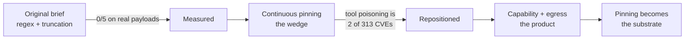

# Design history — what changed from the original plan, and why

toolwall began as a 2-week MVP brief for a "MCP Guardrail Proxy" built around regex sanitization of
tool descriptions. Almost none of that survived contact with measurement. This page records what
changed and what the evidence was, because the reasoning is more useful than the conclusions —
and because several of the original assumptions are ones a reasonable engineer would make again.

The original brief (`PROMPT.md`, `IDEA.md`) has been removed; it is in git history at `b23771c`.



## 1. The protocol had moved

The brief targeted SSE and an `initialize` handshake. Verified against the live spec and a byte-exact
read of `schema.ts`:

| Brief assumed | Reality (verified 2026-08-19) |
|---|---|
| SSE is a primary transport | Deprecated since `2025-03-26`, removal-eligible |
| `initialize` handshake to hook | **Removed** in `2026-07-28` — `grep -c initialize schema.ts` → `0` |
| Sessions via `Mcp-Session-Id` | Removed from Streamable HTTP |
| Server→client requests | Forbidden; moved inside results as MRTR `inputRequests` |

But the deployed ecosystem is one revision *behind* the spec: `@modelcontextprotocol/sdk@1.30.0`
declares `LATEST_PROTOCOL_VERSION = '2025-11-25'`. So the brief's design works against what people
actually run — it just has a shelf life. toolwall targets `2025-11-25` behind an era adapter.

## 2. The brief's core defense detects 0% of real attacks

`IDEA.md` shipped a `MALICIOUS_PATTERNS` regex array. Run verbatim against five canonical *published*
payloads (Invariant shadowing, Invariant `sidenote`, Invariant WhatsApp rug pull, Trail of Bits
line-jumping, CyberArk ATPA):

```
MISS  invariant_shadowing        len=238      MISS  trailofbits_linejumping  len=125
MISS  invariant_sidenote         len=172      MISS  cyberark_atpa_result     len=132
MISS  invariant_whatsapp_rugpull len=158      Detection rate: 0/5
```

All five are also under the brief's 300-character truncation limit, so truncation is a no-op on every
one. Real payloads do not say *"ignore previous instructions"*; they say *"to prevent proxying issues"*,
*"for GDPR, and SOC2 COMPLIANCE"*, and *"otherwise the tool will not work"*.

**toolwall ships no phrase blocklist.** The one text-level control that survived is
invisible-character and ANSI rejection, which measures 0.0% false positives across 90 benign cases —
and whose honest catch rate is **1 of 8** published payloads, because seven are plain visible English.

## 3. The brief guarded a fraction of the attack surface

It filtered `tools/list` descriptions and `tools/call` arguments. Attacker-controlled natural language
also reaches the model through tool **results**, `server/discover.instructions`, schema field
descriptions, enum values, `_meta`, prompt and resource metadata, progress messages, and error text.

Every headline real-world incident of 2025–26 — GitHub MCP exfiltration, Supabase/Cursor, Atlassian
JSM, Agentjacking/Sentry — arrived through **tool results plus over-privileged credentials**, not
through a poisoned description.

## 4. The repositioning: pinning is the substrate, not the pitch

Continuous pinning was chosen as the wedge because nobody ships it — tool signing has been proposed to
the MCP spec seven times since June 2025 and rejected or stalled every time, and the 2026 roadmap omits
signing, identity and provenance entirely. That reasoning holds.

But pinning answers *"did this change?"*, not *"can this hurt me?"* Three pieces of evidence moved the
emphasis:

- **Tool poisoning is 2 of 313 catalogued MCP CVEs.** Command injection and broken auth are 203. (Tool
  poisoning is under-counted because there is often no vendor to assign a CVE to — GitHub said exactly
  that about their own MCP server — but not by two orders of magnitude.)
- **Pinning would have stopped none of the headline incidents.** Each was remediated by capability
  reduction: read-only mode, not running as `service_role`, lockdown mode.
- **A control requiring configuration protects nobody.** The default tier measured 0.0% false
  positives — and with no policy file, blocked approximately nothing.

So capability and egress constraint became the product, and inference made them work at zero config:
**0/17 → 16/17 caught, at 0.0% measured false positives.** Pinning remains load-bearing underneath —
without a pinned contract, an attacker widens their own schema and the malicious arguments become
"valid" (contract C-1).

## 5. The latency budget was below the floor

The brief specified sub-5ms overhead. A raw byte-relay benchmark — two pipes, parsing nothing, guarding
nothing — is flat at ±0.45ms from 9 bytes to 860 KiB. **Interposition is free.** The cost is the JSON
codec: on an 860 KiB / 48k-node payload, parse-and-re-serialize alone is **+9.24ms with every guard
removed**. Any MCP proxy that reads traffic and forwards it unchanged misses a 5ms budget by 94% while
guarding nothing.

The budget is now a function of payload shape, with constants fixed in source:
**`added mean ≤ 0.70ms + 0.03ms/KiB + 0.16ms/1k nodes`**. See [performance](./performance.md).

## 6. What the brief got right

- **The problem.** Tool poisoning and rug pulls are real, documented, and structurally unaddressed.
- **The architecture.** A local proxy between client and server is the right shape, and the spec now
  treats intermediaries as first-class.
- **Hash pinning.** Named in the brief, and it survived as the integrity substrate.
- **Human-in-the-loop on mutations.** Correct instinct — though measurement reshaped it: developers
  approved harmful actions **86.4% of the time** (n=1,053), so confirmation is a scarce budget for
  irreversible operations, never a general filter. A proxy that prompts on every call has built a
  rubber stamp.
- **The three-stream split.** Genuinely parallelisable. Its one blind spot: every serious defect found
  in this project lived at an integration *seam*, not inside a module — a pin lookup that always
  missed, a block error that relayed the attacker's payload, two weeks of guards that were never
  registered. Module-level tests cannot see those.

## Further reading
[Positioning](./positioning.md) · [Threat model](./threat-model.md) · [Research brief](./research-brief.md) · [Performance](./performance.md)
