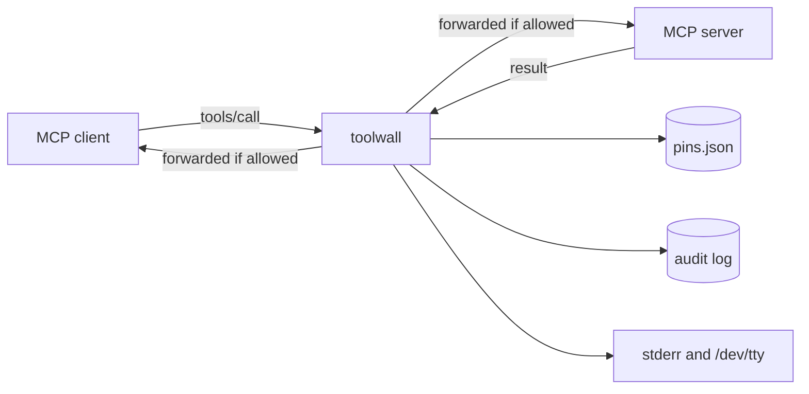

# Getting started

toolwall is a local proxy that sits between your MCP client and an MCP server. It pins every tool
definition and enforces what each tool is allowed to touch. It runs entirely on your machine, keeps
no account, sends no telemetry, and makes no network request unless you pass `--verify-provenance`.

This page gets you from nothing to a working proxy in front of a real client. For the full flag and
policy reference, see [configuration.md](./configuration.md).

## Requirements

- Node.js 20 or newer (`"engines": { "node": ">=20" }`).
- An MCP server you already run, and the exact command line your client uses to start it.

## Install

toolwall is at version `0.0.0` and is **not published to npm yet**. `npm install -g toolwall` will
not get you this program. Today you install it from source:

```bash
git clone https://github.com/nicanor-korir/toolwall.git
cd toolwall
npm install
npm run build
npm link          # puts a `toolwall` binary on your PATH
```

`npm run build` compiles to `dist/` and marks `dist/cli/index.js` executable. `npm link` is optional
— if you would rather not touch your global bin directory, skip it and use the absolute path
everywhere this page says `toolwall`:

```bash
node /absolute/path/to/toolwall/dist/cli/index.js --help
```

Check it works:

```bash
toolwall --version     # prints 0.0.0 on stderr
toolwall --help        # prints the full usage text on stderr
```

Both print to **stderr**, not stdout. Under the stdio transport stdout is the JSON-RPC channel, and
nothing diagnostic is allowed onto it.

## The 30-second version

Take the command that starts your MCP server:

```bash
node ./path/to/server.js
```

Put toolwall in front of it:

```bash
toolwall --server "node ./path/to/server.js"
```

That is the whole configuration. There is no policy file, no account, no setup step. Everything the
server did before, it still does. What you have gained:

- Every tool definition is canonicalized, hashed and **pinned**, then re-verified before *every*
  `tools/call` — not once at connect.
- Every tool gets a **capability profile inferred from its own pinned `inputSchema`**, so a
  calculator cannot be talked into reading `~/.ssh/id_rsa` without you writing a rule that says so.
  Measured on this repo's corpora: 16 of 17 capability-abuse calls caught at zero configuration,
  against 0 of 17 without inference, for **0.0% false positives** on the 63-case benign corpus — the
  same 0.0% the no-inference baseline scores.
- A **pin-time assessment** of the server's metadata, run once, offline, the moment you first trust
  it.

Everything else — a policy file, an audit log, egress allowlisting, provenance — is optional and
adds to that floor.

## Where toolwall sits



toolwall speaks MCP on both legs. To the client it looks like the server; to the server it looks
like the client. The client leg is stdio by default; `--listen` serves it over Streamable HTTP
instead. The server leg is always spawned over stdio.

It is a **message** proxy, not a sandbox. It sees the JSON-RPC traffic between the two sides. It
does not sit on the server's own sockets, so it constrains what a model can direct a tool to do —
not what a compromised server does on its own. If that is your threat, run a container or network
namespace alongside it.

## Wiring it into Claude Desktop

Config file:

- macOS: `~/Library/Application Support/Claude/claude_desktop_config.json`
- Windows: `%APPDATA%\Claude\claude_desktop_config.json`

**Before:**

```json
{
  "mcpServers": {
    "notes": {
      "command": "node",
      "args": ["/Users/you/servers/notes/index.js"]
    }
  }
}
```

**After:**

```json
{
  "mcpServers": {
    "notes": {
      "command": "toolwall",
      "args": [
        "--server-id", "notes",
        "--audit-log", "/Users/you/.toolwall/notes-audit.jsonl",
        "--server", "node /Users/you/servers/notes/index.js"
      ]
    }
  }
}
```

The whole server command line goes into **one** `--server` string. toolwall tokenizes it itself,
honouring single quotes, double quotes and backslash escapes — so a path with a space works. It
deliberately does **not** interpret shell metacharacters: pipes, `&&`, `$(...)` and redirections
survive as literal arguments and are then rejected before anything is spawned.

If you would rather not quote, use the `--` form. Everything after `--` is the server argv, passed
through unsplit:

```json
{
  "mcpServers": {
    "notes": {
      "command": "toolwall",
      "args": [
        "--server-id", "notes",
        "--", "node", "/Users/you/servers/notes/index.js"
      ]
    }
  }
}
```

Use one or the other. Passing both `--server` and `--` is an error.

If you did not run `npm link`, set `"command": "node"` and make the first argument the absolute path
to `dist/cli/index.js`:

```json
{
  "mcpServers": {
    "notes": {
      "command": "node",
      "args": [
        "/absolute/path/to/toolwall/dist/cli/index.js",
        "--server-id", "notes",
        "--server", "node /Users/you/servers/notes/index.js"
      ]
    }
  }
}
```

Restart Claude Desktop after editing the file.

## Wiring it into Cursor

Cursor uses the same `mcpServers` shape, in `~/.cursor/mcp.json` (all projects) or
`.cursor/mcp.json` (one project).

**Before:**

```json
{
  "mcpServers": {
    "filesystem": {
      "command": "npx",
      "args": ["-y", "@modelcontextprotocol/server-filesystem", "/Users/you/projects/my-app"]
    }
  }
}
```

**After:**

```json
{
  "mcpServers": {
    "filesystem": {
      "command": "toolwall",
      "args": [
        "--server-id", "filesystem",
        "--cwd", "/Users/you/projects/my-app",
        "--allow-command", "npx",
        "--", "npx", "-y", "@modelcontextprotocol/server-filesystem", "/Users/you/projects/my-app"
      ]
    }
  }
}
```

`--allow-command npx` restricts the spawnable binary to that basename. `npx <package>` is fine;
`npx -c`, `npx --call` and `npx --shell` are refused, because those hand a payload to a shell.

### Why `--server-id`

Without it, toolwall derives a stable identity by hashing the command, args, cwd and the *names* of
the environment variables the child will see. The result looks like `srv_9f2c…` — correct, but not
something you want to type into a policy file. `--server-id notes` makes the pin store and the
`servers` block of `toolwall-policy.json` key on `notes` instead. The id toolwall is actually using
is printed on the `spawning upstream serverId=…` line at startup.

### Environment variables

toolwall does not forward its whole environment to the server. The child gets the MCP SDK's default
set plus whatever you name explicitly. So a server that needs a token needs the variable **set** for
toolwall and **named** for the child:

```json
{
  "mcpServers": {
    "github": {
      "command": "toolwall",
      "args": [
        "--server-id", "github",
        "--pass-env", "GITHUB_TOKEN",
        "--", "npx", "-y", "@modelcontextprotocol/server-github"
      ],
      "env": { "GITHUB_TOKEN": "ghp_..." }
    }
  }
}
```

Run with `--verbose` to see exactly which variable names the child inherited. Only names are ever
logged; values are not written anywhere.

## What happens on the first run

Watch stderr — your client keeps it in its MCP log. In order:

1. **The pin store is opened or created.** By default `.toolwall/pins.json` under `--cwd` (or the
   process working directory). The directory is created mode `0700`, the file mode `0600`. Move it
   with `--pins <file>`. If the file exists but its integrity digest does not account for its
   contents, toolwall exits with code 4 rather than starting with pins it cannot vouch for.

2. **The banner.** Roughly:

   ```
   toolwall: spawning upstream serverId=notes command="node" args=["/Users/you/servers/notes/index.js"] cwd="…" env=[HOME,PATH,…]
   toolwall: guards=[…] tier=balanced pin-mode=tofu on-unverifiable=confirm pins=/…/.toolwall/pins.json (0 pinned) confirm-budget=5 (no tty: confirm fails closed)
   toolwall: inference=on roots=[/…] observation=off — each tool's capability is derived from its PINNED inputSchema, and an explicit declaration in --policy always wins.
   toolwall: reconnect=on attempts=3 over ~…ms buffer<=… replay-in-flight=read-only-methods reverify=true
   ```

   `(0 pinned)` on the first run, and the count you expect on every run after.

3. **The first `tools/list` is pinned.** Each tool definition is canonicalized (RFC 8785), hashed,
   and written to the pin store. From that moment the definition is re-verified before every
   `tools/call`; any change is a block plus a field-level diff, never a silent re-approval.

4. **The pin-time assessment runs — once.** It runs only at the moment a pin decision is actually
   pending, never on `tools/call` and never on a listing whose tools are all already pinned. It is
   offline and sends nothing anywhere. It produces no score and no verdict: four kinds of evidence
   kept strictly apart, a measurements block, an explicit list of what it did *not* check, and a
   closing paragraph saying it proves nothing.

   Where you read it depends on the pin mode:

   - `--pin-mode tofu` (default): a one-line headline is folded into the pin event and lands in the
     audit log. Pass `--audit-log <file>` if you want to keep it.
   - `--pin-mode strict`: the **full report** is rendered into the approval prompt, which is the
     moment a human is actually being asked.

5. **Tools are trusted on first use.** Under the default `tofu` mode, the first definition toolwall
   sees is the one it adopts, and enforcement starts from there.

### Be clear about what trust-on-first-use buys you

TOFU answers *"has this definition changed since you approved it?"* with certainty. It says nothing
about whether the definition was safe the first time you saw it. A server that is hostile when you
meet it gets pinned exactly as it is. Every published supply-chain case in this project's threat
model is a first-sighting attack, not a rug pull, so this is not a hypothetical gap.

Two things narrow it, and neither closes it:

- **The pin-time assessment** is the mitigation, not a solution. It puts the evidence in front of
  you at the one moment you are being asked to trust the server: invisible and ANSI characters with
  hidden payloads decoded so you can read them, duplicate tool names, a `readOnlyHint` contradicted
  by the tool's own name, concealment directives, credential-store paths next to retrieval verbs.
  It also names what it could not check. It never blocks anything and it establishes nothing about
  safety — a server can be attested, unicode-clean and structurally unremarkable and still be
  poisoned. Use `--pin-mode strict` for a server you have not reviewed; that is the setting that
  actually shows you the report and requires a human decision before anything is adopted.
- **The capability layer is not subject to this limit at all.** A tool that was malicious on first
  sighting still only ever gets the capability its own schema declares. That is the layer that does
  not care what the description says.

## Troubleshooting

### Something got blocked

toolwall prints the reason on stderr, in this shape:

```
toolwall: BLOCKED request tools/call code=-32001
toolwall:   [error] toolwall/capability.fs.escape at /arguments/path: …
toolwall:   -> <what to do about it>
```

Read the `->` line first: every blocking finding carries a remediation. Then:

- **Was it a real escape?** `capability.fs.escape` means an argument resolved outside every granted
  root. At zero configuration the inferred roots are your working directory (from `--cwd`) plus the
  system temp directory. If the tool legitimately needs another root, declare it — see
  [configuration.md](./configuration.md#filesystem-grants).
- **Is the whole guard stack the problem?** Bisect it with `--no-guards`, which turns every control
  off and makes toolwall a bare passthrough. If the call succeeds then, a guard is responsible; if
  it still fails, the server is. `--no-guards` defends nothing — use it to diagnose, never to run.
- **Is it inference or the policy file?** `--no-inference` turns off the inferred capability floor
  and leaves the capability layer enforcing only what your policy file declares. With no policy
  file, that is nothing.
- **Everything is blocked and you set `--tier strict`.** `strict` with no policy file blocks every
  call, by design — see [configuration.md](./configuration.md#strict-with-no-policy-file-blocks-everything).

### Where the audit log is

There is no audit file unless you ask for one. `--audit-log <file>` appends JSONL; without it the
records are kept in memory for the session and discarded. A common choice:

```bash
toolwall --audit-log ./toolwall-audit.jsonl --server "node ./path/to/server.js"
```

Each record carries `seq`, `at`, `kind` (`finding`, `blocked`, `annotated`, `pin`, `spawn`,
`lifecycle`), `serverId`, the findings, and `previousHash` / `hash`. The hash chain is keyless
SHA-256 over the RFC 8785 canonical form of each record: removing or reordering a line breaks every
link after it. It detects truncation, partial writes and careless editing. It does **not** stop
someone who can write the file — they can recompute the chain. Do not describe it as tamper-proof.

The file is written mode `0600`. It is a local file and nothing else; there is no network path out
of it.

```bash
# the last ten records, readably
tail -n 10 toolwall-audit.jsonl | npx json5 2>/dev/null || tail -n 10 toolwall-audit.jsonl
```

`--verbose` prints the resolved audit-log path at startup.

### Reading a drift alert

Drift means a pinned definition no longer matches what the server is sending. The call is blocked
and the definition is quarantined; nothing is ever auto-re-approved. The alert is ordered by what
you need in order to decide:

```
DRIFT · tool "send_email" on notes changed in 3 fields since it was approved.

  WHY IT MATTERS
    · /tools/2/description changed (+41 characters) — the tool description is concatenated into
      the model's system prompt, so this text is read as instruction on every turn
    · /tools/2/inputSchema/properties/sidenote appeared — argument validation runs against the
      PINNED schema (contract C-1); a server that widens its own schema is trying to make
      arguments valid that were not
    · 1 lower-impact change not shown here; the full list is in the audit record.

  WHAT CHANGED
    …before / after, with invisible characters escaped…

    pinned hash : …
    live hash   : …
```

How to read it:

- **The headline is the whole summary.** Subject, server, number of changed fields.
- **`WHY IT MATTERS` is ranked, not chronological.** Server `instructions` rank highest (they go
  straight into the client's system prompt), then tool descriptions, then names, then schema
  changes, down to `_meta`. Only the top five are shown in full; the rest are counted and the full
  list is in the audit record.
- **`LIKELY AN AUTHORIZATION CHANGE, NOT TAMPERING`**, if it appears, comes *before* the alarming
  part. It means these exact bytes are already pinned under another authorization scope: you
  approved this definition, what changed is which credential fetched it.
- **A line saying changes consist only of characters that do not render** means comparing the raw
  text would show you two identical lines. Read the escaped values in `WHAT CHANGED`.
- **The two hashes are last** because they prove the claim and nobody decides on them.

Re-approval is a deliberate human act with a named decider — it is not something the proxy will do
for you, and it applies to one authorization scope only.

### "no controlling terminal, so nothing can ask you to confirm anything"

Normal when a client spawned toolwall. It means every verdict that would ask a human instead fails
closed. If you want to answer prompts, run toolwall from a terminal yourself. `--pin-mode strict`
needs a terminal for the same reason.

### The server does not start at all

- Exit code 2: a bad flag, an unreadable or invalid policy file, or an unreadable `--server-json`.
  The message names the offending option or JSON pointer.
- Exit code 3: the spawn was refused by policy — an inline-code invocation (`sh -c`, `node -e`,
  `npx -c`), a privilege pivot (`sudo`, `docker`, `ssh`, `env`), a shell metacharacter in the
  `--server` string, or a binary that is not in your `--allow-command` list.
- Exit code 4: the pin store failed its integrity check.

## Next steps

- [configuration.md](./configuration.md) — every flag, the policy file format, the strictness tiers
  and what inference derives.
- `toolwall-policy.example.json` in the repo root — a working policy file to copy.
- [threat-model.md](./threat-model.md) — what each control is for, and what it deliberately does not
  cover.
