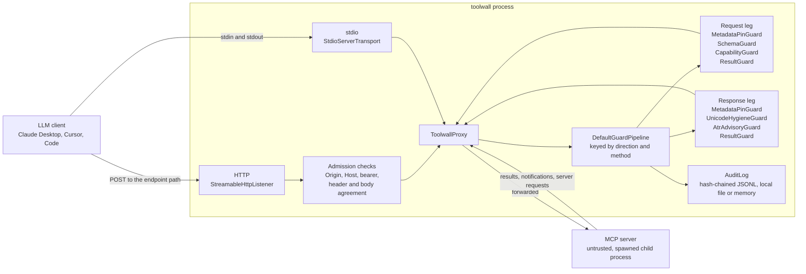
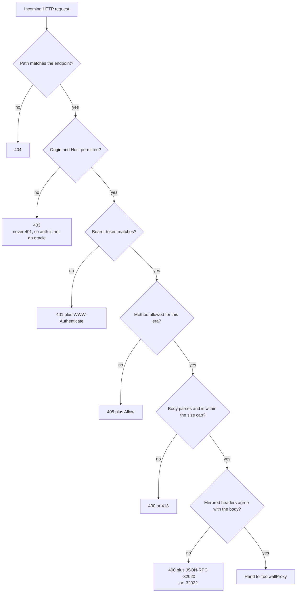
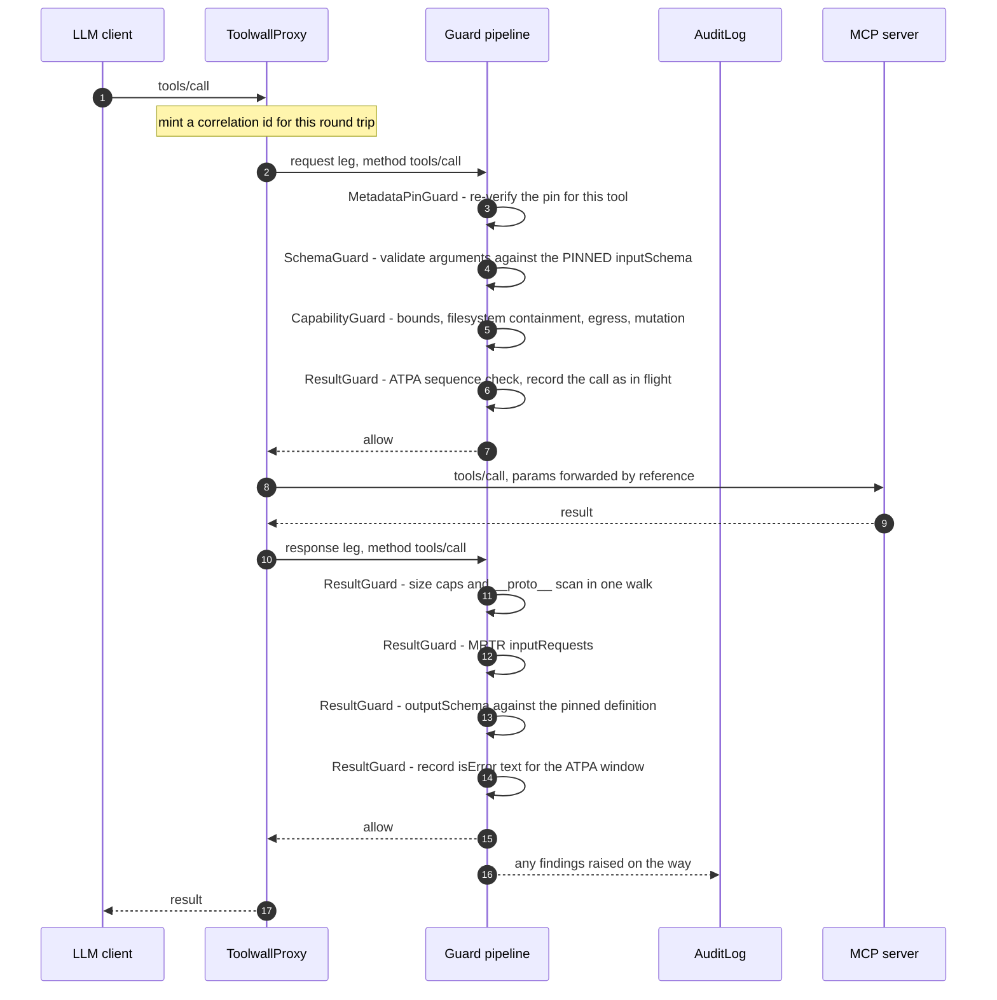
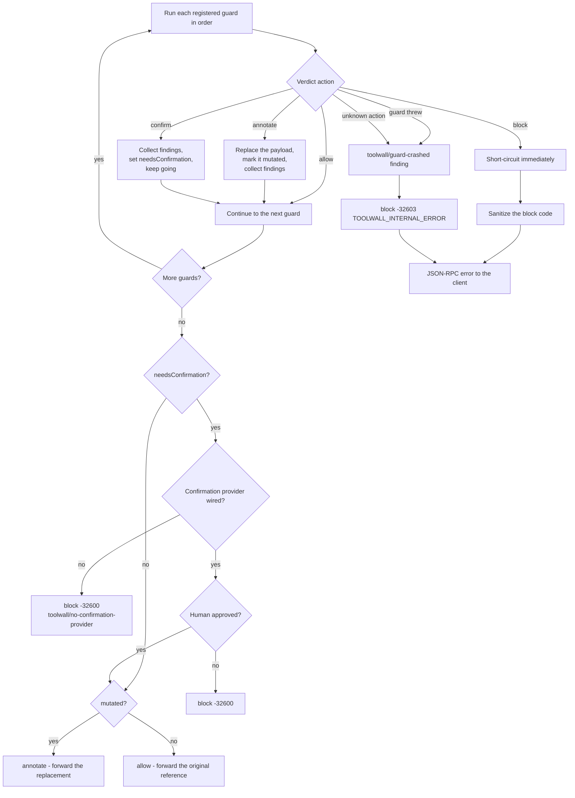
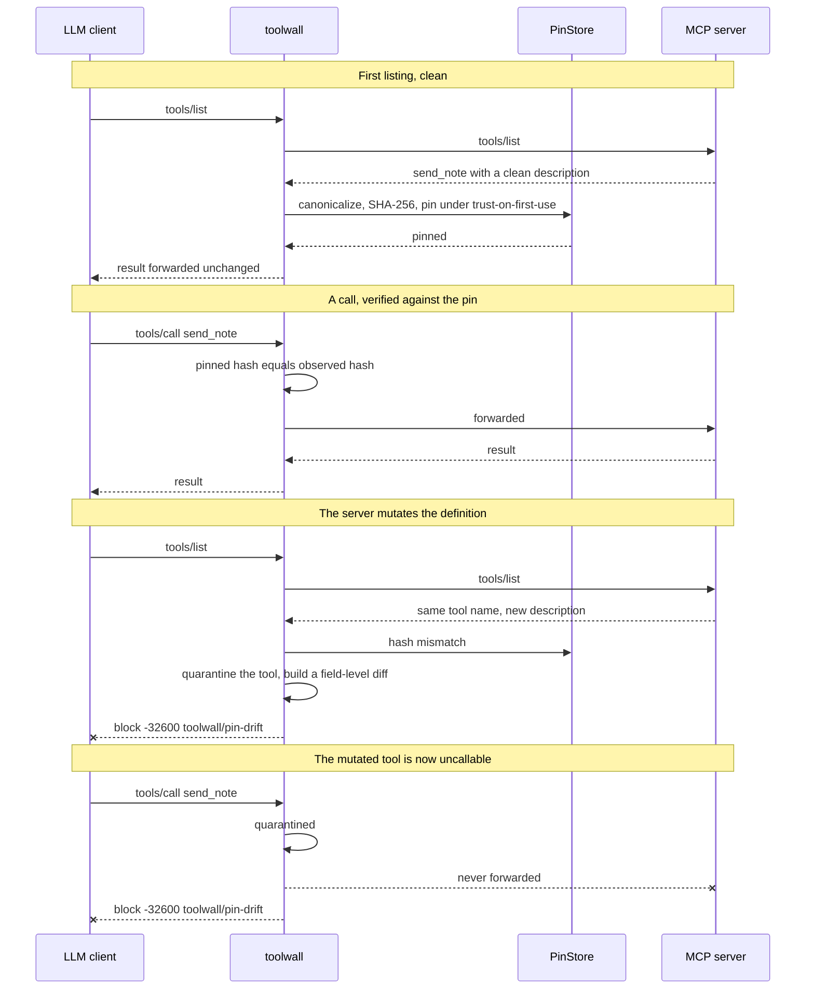
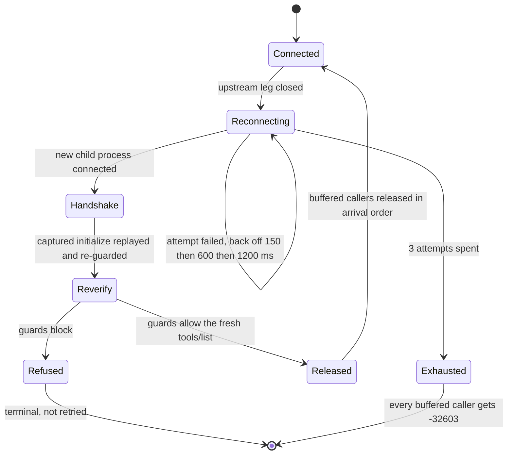

# How toolwall works

toolwall is a proxy. Your MCP client talks to toolwall; toolwall talks to the MCP server. Every
JSON-RPC message crosses it in both directions, and a small set of guards get to look at some of
them.

This page traces the actual path a message takes. It is written for someone deciding whether to
adopt toolwall, or debugging why a call was blocked. For what each guard checks, see
[`guards.md`](./guards.md). For what toolwall defends against and what it explicitly does not, see
[`threat-model.md`](./threat-model.md).

---

## 1. The shape



The trust boundary sits between toolwall and the server. Everything the server sends — tool
descriptions, results, error strings, `instructions`, `_meta` — is treated as attacker-controlled
data, never as instruction. That is why a server-to-client request such as `sampling/createMessage`
is inspected on the **response** leg even though JSON-RPC calls it a request: direction here means
"which way across the trust boundary", not "which JSON-RPC message kind".

---

## 2. Two front doors

### stdio — the default

`toolwall --server "node ./server.js"` puts toolwall where the server used to be in your client
config. toolwall's stdin and stdout are the protocol channel. The child's stderr is piped, never
inherited, so the server can never write into the protocol stream.

Nothing is spawned and no transport is started until `start()` is awaited, and the spawn spec is
validated first — argument-level validation, not just command allowlisting.

### Streamable HTTP — `--listen`

An HTTP listener is the riskiest thing a local security tool can open, so the admission checks run
before anything reaches a guard, in this order:



Points worth knowing before you enable it:

- It binds `127.0.0.1` unless you name another address, and warns loudly when you do.
- A bearer token is required on every request. There is no flag to disable it. When you supply
  none, a 256-bit token is generated at startup and printed once on stderr.
- The `Host` check refuses any non-loopback authority whether or not an origin allowlist was
  configured. The SDK's own DNS-rebinding protection is additionally switched on explicitly,
  because the SDK default is off.
- Header/body agreement is checked by the **transport**, not by a guard. That is why it is allowed
  to emit `-32020 HeaderMismatch` (or `-32022 UnsupportedProtocolVersion`): the MCP spec assigns
  those codes to exactly those conditions. A guard returning a code in that range would be
  rewritten (see §5).
- There is no TLS and no OAuth. A loopback listener with a shared secret is the honest primitive
  for a local control plane.
- Era shapes differ. `2025-11-25` allows `POST`, `GET` and `DELETE`, with sessions and
  resumability. `2026-07-28` is POST-only and answers `405` to the others. Under the POST-only lane
  a server-to-client message that is not the answer to an in-flight POST **has no channel** and is
  reported on the operator channel and dropped. That is a real limitation of that lane.

The upstream leg over HTTP is implemented and tested but is not reachable from `assembleToolwall()`
yet — that function takes a spawn spec and builds a stdio child. An embedder reaches it through
`ToolwallProxy` directly.

---

## 3. The guard pipeline

Guards are registered per `(direction, method)` pair. The pipeline supports a wildcard, and
toolwall's assembly never uses it. The full registration set:

| direction | method | guards, in order |
|---|---|---|
| request | `tools/call` | MetadataPinGuard, SchemaGuard, CapabilityGuard, ResultGuard |
| response | `initialize` | MetadataPinGuard, UnicodeHygieneGuard, AtrAdvisoryGuard\* |
| response | `server/discover` | MetadataPinGuard, UnicodeHygieneGuard, AtrAdvisoryGuard\* |
| response | `tools/list` | MetadataPinGuard, UnicodeHygieneGuard, AtrAdvisoryGuard\* |
| response | `notifications/tools/list_changed` | MetadataPinGuard |
| response | `tools/call` | ResultGuard |
| response | `resources/read` | ResultGuard |
| response | `prompts/get` | UnicodeHygieneGuard, ResultGuard |
| response | `elicitation/create` | UnicodeHygieneGuard, ResultGuard |
| response | `sampling/createMessage` | UnicodeHygieneGuard, ResultGuard |
| response | `prompts/list` | UnicodeHygieneGuard |
| response | `resources/list` | UnicodeHygieneGuard |
| response | `resources/templates/list` | UnicodeHygieneGuard |
| response | `completion/complete` | UnicodeHygieneGuard |

\* only when an operator supplied an `agent-threat-rules` scanner. Nothing constructs one by
default.

**Everything else forwards untouched.** `ping`, `roots/list`, `resources/subscribe`,
`logging/setLevel`, unknown methods and future methods all miss the map. The pipeline's
`hasGuards()` returns false, and the proxy forwards the payload object *by reference*: no
inspection, no clone, no canonicalization, no re-serialization by toolwall. That is the
transparency guarantee. (The JSON-RPC envelope is still parsed and re-encoded by the SDK's own
stdio codec, which every MCP peer does on its own read path, direct connection or not.)

### Why that order on `tools/call`

1. **MetadataPinGuard first.** If the tool definition no longer matches the approved one, nothing
   downstream is meaningful — the schema, the annotations and the description are all
   attacker-controlled as of that moment. Identity before content.
2. **SchemaGuard second, reading the *pinned* definition.** If it validated against the live
   `tools/list`, an attacker would widen their own schema first and their hostile arguments would
   become "valid". The rug pull would legalise its own payload.
3. **CapabilityGuard third.** It is the only guard that touches the filesystem, so it runs only on
   calls the two cheap deterministic checks already accepted.
4. **ResultGuard last.** The pipeline short-circuits on a block, so a call the guards above rejected
   is never recorded as in flight for a result that will never arrive.

Because the pipeline short-circuits, the finding you see names the most fundamental problem rather
than a downstream symptom of it.

---

## 4. A `tools/call`, end to end



Two things this diagram compresses:

- **Correlation.** The proxy mints one id per round trip and writes it on both legs, so ResultGuard
  pairs a result with the call it answers by map lookup rather than by guessing. Concurrent calls
  do not confuse it.
- **MRTR lifting.** Under `2026-07-28`, if the result carries `inputRequests`, each embedded request
  is run through the pipeline a second time as `("response", <embedded method>)`. So the
  `("response", "sampling/createMessage")` registration fires on a live server-to-client request
  under `2025-11-25` **and** on the copy embedded in a `tools/call` result under `2026-07-28`, with
  no era branch inside any guard. Only entries a guard actually replaced are rebuilt; otherwise the
  whole result is forwarded by reference.

---

## 5. How a verdict is resolved

A guard returns one of four actions. Precedence is `block > confirm > annotate > allow`.



What each action actually does:

**allow** — the payload is forwarded unchanged. If the guard raised non-blocking findings (things it
could *not* check: an unresolvable `$ref`, a regex it refused to compile, a symlink it traversed
that stayed in root), those go to the audit sink. They never read as "safe".

**annotate** — the guard returns a replacement payload, which is forwarded in place of the original.
The pipeline marks the outcome `mutated` so the transport knows it may not forward the original
reference.

**confirm** — collected, not resolved immediately. After every guard has run, the confirmation
provider is asked once. Confirmation is treated as a **scarce budget**, not a filter: there is a
hard per-session cap (5 prompts at `permissive` and `balanced`, 3 at `strict`), and only rules
naming genuinely irreversible operations may spend from it. A `confirm` from any other rule is
denied *without prompting*. With no interactive channel — the ordinary case under stdio, where
stdin and stdout are the protocol — every `confirm` fails closed. The prompt is written to
`/dev/tty`, never to stdout.

**block** — fails closed. The request never reaches the far side; a blocked response never reaches
the client. A notification that is blocked is simply dropped, which is still fail-closed. Nothing
downstream can relax a block: the pipeline returns immediately and no later guard or transport
error path can override it.

**A guard that throws is a block.** A crashed control is not a passed control. The pipeline emits a
`toolwall/guard-crashed` critical finding, records a `guard-crashed` lifecycle entry in the audit
log, and blocks with `-32603`. The same happens for a third-party guard returning an action toolwall
does not recognise.

### Block codes

The default block code is `-32600`. `-32603` is used for internal failures. Before a block code
reaches the wire it is sanitized:

- Anything that is not a safe integer becomes `-32600`.
- **Anything in `-32020..-32099` becomes `-32600`.** That range is reserved for the MCP spec, and
  implementations must not invent codes in it. A guard cannot know whether it is speaking about the
  spec's condition or its own, so guards never keep a code in that range. The transport can and
  does emit `-32020` for a header/body mismatch, because that is the code the spec assigns to
  exactly that condition.

### What the client is told

A block produces a JSON-RPC error whose message names the rule ids only, plus a `data.toolwall`
object carrying the direction, the method, the server id, the era, and a **redacted** copy of each
finding: `ruleId`, `severity`, `locus`, `remediation`, and a `detail` field that says the real
detail was withheld.

`message` and `evidence` are never relayed to the client. They quote the untrusted server's own
text — on a drift block, that is the attacker's injected string verbatim, the very thing the block
exists to keep away from the model. LLM clients routinely surface error text to the model, so
relaying it would deliver the payload through the alarm about it. `locus` and `remediation` *are*
relayed, but sanitized first: a locus is a JSON Pointer into an attacker-controlled payload, so its
path segments are names the untrusted side chose.

The full unredacted finding, including the field-level diff, goes to toolwall's stderr and to the
audit log. Those are operator channels.

---

## 6. The rug pull, concretely

This is the case toolwall was built around: a tool that is benign when you approve it and mutates
later. Verification happens **before every `tools/call`**, not at connect and not at the handshake.



Three properties of this that matter:

- **The pin is never updated automatically.** Drift produces a block, a diff and a quarantine entry.
  Leaving quarantine requires `approveQuarantined()` with a named human decider; the store refuses
  anything automated.
- **A `notifications/tools/list_changed` with no re-listing marks the catalogue stale**, and calls
  against a stale catalogue are *unverifiable* rather than allowed. The default disposition for
  unverifiable is `confirm`.
- **A change whose exact bytes are already pinned under a different authorization scope** is
  reported as `medium`, not `critical`, and the alert says so. That is an operator changing
  credentials, not a rug pull. It still blocks — approval is per scope — but it does not read like
  an attack.

---

## 7. Reconnect, and why it is not a way around a guard

The upstream server going away used to take the whole client session down with it. With reconnection
on (the default), callers park on a gate instead.

The security problem this creates is specific: the pin store is keyed on `serverId`, which is
derived from the *launch spec* and is therefore identical across a restart — deliberately, so a
routine restart does not orphan every pin. Without a re-verification gate, a `tools/call` released
after a reconnect would be checked against the catalogue the **previous process** advertised. A
server that can arrange its own crash would get a definition swap for free.



The gate in detail:

- **Buffering.** The gate parks the whole relay closure — its params, its abort signal, its response
  continuation stay where they are. Releasing the buffer is just resolving promises, so nothing is
  re-serialized and request/response correlation cannot drift. Waiters are released in arrival
  order. The buffer is bounded at 256 callers; over that, the newest caller gets `-32603`
  immediately rather than the process running out of memory.
- **Re-verification, before a single buffered request is released.** Three steps:
  1. A synthetic `notifications/tools/list_changed` is driven through the pipeline, which marks the
     cached catalogue stale using the guard's own tested staleness path.
  2. Under `2025-11-25`, the client's captured `initialize` is replayed against the new process and
     the result is run through the `("response", "initialize")` guards. That result carries
     `instructions`, which is both a pinned surface and a top-ranked injection surface. The result
     is *not* relayed to the client — it already has one.
  3. A `tools/list` is issued and run through the same `("response", "tools/list")` guards a
     client-originated listing would hit.
- **A block there is terminal.** The buffer fails closed with `-32603` and
  `reason: "reverification-failed"`, the session drains and closes. It is not retried, because
  retrying is offering the attacker another go until toolwall accepts it.
- **If the server cannot be listed at all**, the catalogue stays stale, which is not a bypass: a
  stale catalogue is unverifiable, and the pin guard applies the configured disposition.
- **In-flight requests are not silently replayed.** A request that was never sent is always buffered
  and delivered — that is exactly-once. A request already written to a server that then died has an
  *unknown* execution status. The default `replayInFlight: "read-only-methods"` replays only
  `initialize`, `server/discover`, `ping`, `tools/list`, `prompts/list`, `prompts/get`,
  `resources/list`, `resources/read`, `resources/templates/list` and `completion/complete`, and
  returns `-32603` with `reason: "not-replayable"` for everything else, saying so. `tools/call` is
  excluded at every setting.

  Be honest about what that default costs: those methods are read-only *by contract*, and the
  contract is the untrusted party's. A hostile server can make `resources/read` side-effecting. What
  the exclusion of `tools/call` bounds is the blast radius — to what a server does to itself, not to
  the user's money or disk. `--replay-in-flight none` exists for operators who do not accept that.

Every restart re-runs spawn validation and is recorded in the audit log with `reason: "reconnect"`.
A reconnect also builds a **fresh** client-side protocol instance; reusing one across connections is
what cost the SDK a message-id collision CVE.

---

## 8. The audit sink

One `AuditLog` per session receives:

| kind | when |
|---|---|
| `spawn` | every child process launch, including reconnect respawns. Env **key names** only; values are never written anywhere |
| `pin` | pinned, verified, drift, unverifiable, withdrawn, stale, algorithm-changed, malformed, cache-public, cache-ttl |
| `blocked` | any guard block, with the code and the full findings |
| `annotated` | a guard replaced the payload |
| `finding` | non-blocking findings from a guard that returned `allow` — the record of what could *not* be checked |
| `lifecycle` | connection events, reconnect attempts, confirmation decisions, guard crashes, provenance failures |

Each record carries `previousHash` and `hash = SHA-256(JCS(record without hash))`. Removing or
reordering a record breaks every subsequent link and `verifyChain()` reports the first failing
index. This is **keyless**. It detects truncation, partial writes and careless editing. It does not
stop someone who can write the file — they can recompute the chain. Do not call it tamper-proof.

Writes are queued behind a single promise and never awaited by the caller, so a slow disk cannot add
latency to a `tools/call`. There is no network path in the audit log and there must never be one.

---

## 9. What this costs

The added latency splits into three layers, and `npm run bench` measures each separately:

- **relay** — interposition itself. Measured flat across a range spanning 9 bytes to 860 KiB, with
  no trend. **Interposition is free.** The extra process hop was the hypothesis, and it was wrong.
- **codec** — one extra JSON-RPC parse and one re-serialize per leg. On the largest workload this
  is the dominant term *with every guard removed*, and it is what any proxy pays that still reads
  what it forwards.
- **guards** — toolwall's own work. It scales with a result's **node count**, not with its byte
  size, which is why a tool returning thousands of structured rows costs more than one returning the
  same bytes in a single string.

The budget the benchmark enforces is therefore shaped, not flat:

```
added mean ≤ 0.70 ms  +  0.03 ms/KiB  +  0.16 ms per 1 000 nodes
```

The constants are fixed in `bench/latency.ts` and deliberately not refitted per run — a budget that
refits itself always passes and detects nothing. `npm run bench` exits non-zero if any workload
misses it.

Full per-workload numbers, the layer attribution, and what is deliberately *not* claimed
(concurrency, a cold pin store on a slow disk, the `tools/list` cold path, any non-stdio transport)
are in [`performance.md`](./performance.md).

---

## 10. Where to look next

- [`guards.md`](./guards.md) — every guard that ships, what it catches, what it does not, and its
  measured false-positive rate.
- [`threat-model.md`](./threat-model.md) — the threats, their real-world anchors, and the explicit
  out-of-scope list.
- [`decisions.md`](./decisions.md) — the contract register the source comments refer to as `C-1`
  and friends.
- [`configuration.md`](./configuration.md) — every flag, the tier table, and the policy file format.
- [`performance.md`](./performance.md) — the full latency model.
- [`positioning.md`](./positioning.md) — why the product leads with capability rather than pinning.
