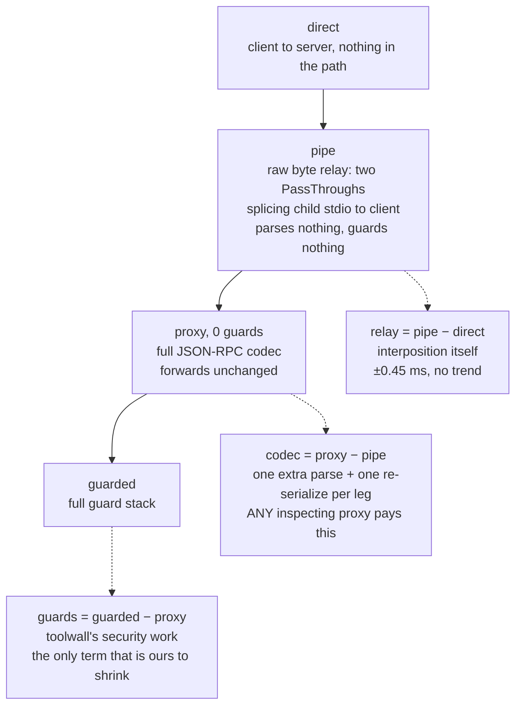
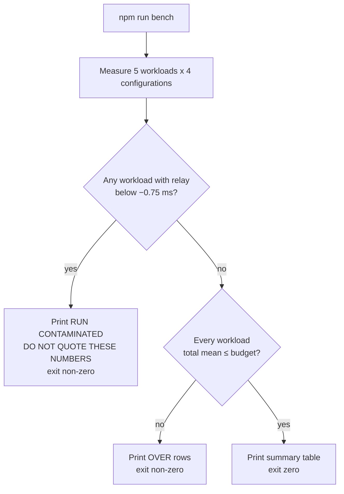

# toolwall — Performance model

The measurement, what it cost to get it right, and the budget that came out of it. The contract
entries behind this document are C-8, C-11, C-28 and C-29 in `docs/decisions.md`.

## The short version

1. **Interposition is free.** A raw byte relay that parses nothing and guards nothing is flat at
   ±0.45 ms across a range spanning 9 bytes to 860 KiB, with no trend. The extra process hop was the
   hypothesis, and it was wrong.
2. **The cost is the JSON codec**, and it is not toolwall's. On the 860 KiB / 48,007-node workload,
   one extra parse and one extra re-serialize per leg is **+9.24 ms with every guard removed**.
3. **Response-leg cost scales with node count, not bytes.** A 64 KiB single string is about six
   nodes and walks in microseconds; 2,000 structured rows is ~12k nodes and does not.
4. **The budget is a curve**, its constants fixed in source, and it gates on the **mean**.
5. **The benchmark detects its own contamination** and exits non-zero rather than print numbers
   someone might quote.

## The three layers

Added latency decomposes into three layers with three different owners. The benchmark measures four
configurations and subtracts them pairwise.



- **relay** = `pipe` − `direct`. Same topology, same process, same stream primitives as the
  zero-guard proxy, with the JSON-RPC codec deleted. It is the physical floor for "something is in
  the path".
- **codec** = `proxy (0 guards)` − `pipe`. One extra JSON-RPC parse and one re-serialize per leg.
- **guards** = `guarded (full stack)` − `proxy (0 guards)`.

## The measurement

`npm run bench`: 1000 sequential `tools/call` after 100 warmup, one request in flight, same fixture
server per configuration, Node v25.2.1 on darwin/x64. Added **mean** latency versus a direct
connection, in milliseconds:

| workload | KiB | nodes | relay | codec | guards | **total added** | budget | headroom |
|---|---|---|---|---|---|---|---|---|
| small — 9 B echo | 0.0 | 5 | −0.37 | +0.14 | +0.12 | **≈0 ms** | 0.70 | — |
| large — 64 KiB in one string | 64.0 | 5 | +0.03 | +0.68 | +1.06 | **+1.76 ms** | 2.62 | 33% |
| narrow — 500 structured rows | 52.2 | 3 007 | +0.01 | +0.57 | +0.26 | **+0.84 ms** | 2.75 | 69% |
| wide — 2000 structured rows | 212.6 | 12 007 | −0.32 | +3.48 | +2.70 | **+5.85 ms** | 9.00 | 35% |
| huge — 8000 structured rows | 860.1 | 48 007 | +0.45 | +9.24 | +7.10 | **+16.80 ms** | 34.18 | 51% |

Read the `relay` column first. It is `−0.37`, `+0.03`, `+0.01`, `−0.32`, `+0.45` — statistically
indistinguishable from zero at every payload size, over a range spanning 9 bytes to 860 KiB, with no
trend. **Interposition is free.**

What costs is *understanding* the traffic. On `huge`, `relay + codec` is **+9.69 ms with every guard
removed** — a proxy that parses the JSON and forwards it unchanged, guarding nothing, already
**misses a 5 ms budget by 94%**. On `wide` the same floor is +3.16 ms and the full stack lands at
+5.85 ms.

A flat sub-5 ms number is therefore not a target that was missed by trying too little; **it is below
the floor** of any implementation, in any language, that still reads what it forwards. It survived
three weeks because no workload in the benchmark had enough nodes to expose it.

### Why node count and not bytes

The `large` and `narrow` rows are the proof. `large` is **64.0 KiB in 5 nodes**; `narrow` is
**52.2 KiB in 3,007 nodes** — fewer bytes, six hundred times the nodes. `narrow`'s guard column is
+0.26 ms against `large`'s +1.06 ms, so bytes are not what the guards cost. The response-leg walk
is per-node, and a 64 KiB string is one node however long it is.

This was discovered the expensive way. A predicted optimisation — fusing the two response-leg walks
(`measure()` and `hasProtoKey()`) into one `measureAndScan()` — was expected to "roughly halve the
large-result cost". Measured in isolation, 20,000 iterations after 2,000 warmup:

| payload | two walks (`measure` + `hasProtoKey`) | one walk (`measureAndScan`) | change |
|---|---|---|---|
| 64 KiB in ONE string (~6 nodes) | mean 0.0014 ms | mean 0.0014 ms | **−2.8%, i.e. nothing** |
| 12,007 nodes / 219 KiB | mean 1.0411 ms, p99 1.3881 ms | mean 0.8313 ms, p99 1.0515 ms | **−20.2% mean, −24% p99** |

The prediction was right about the mechanism and wrong about the workload: the benchmark's "large"
case had no nodes to walk. The benchmark gained node-heavy workloads (`narrow`, `wide`, `huge`) as a
direct result.

## The budget

```
added mean ≤ 0.70 ms  +  0.03 ms/KiB  +  0.16 ms per 1 000 nodes
```

Fixed in `bench/latency.ts` as:

```ts
const BUDGET = {
    fixedMs: 0.7,
    perKiBMs: 0.03,
    perKNodeMs: 0.16
} as const;
```

Each term maps to a layer:

| Term | What it pays for |
|---|---|
| `FIXED` (0.70 ms) | What interposition costs regardless of payload: two extra event-loop turns, the guard pipeline's promise, the pin-store lookups. Dominates `small`. |
| `PER_KIB` (0.03 ms/KiB) | Bytes crossing one extra hop: stream chunking, plus one parse and one serialize. Dominates `large`, where 64 KiB is a single string and the node walk is free. |
| `PER_KNODE` (0.16 ms/1k) | The response-leg traversal. Dominates the row workloads, and is **the only term that is ours to shrink.** |

The constants were derived once from a measured sweep and are **deliberately not refitted per run —
a budget that refits itself always passes and detects nothing.** They carry 33–69% headroom over the
measured values, the tightest being `wide`. That is enough for ordinary machine noise and tight
enough that the regression class the budget exists for — a second full traversal of every result,
the C-11 defect — blows `PER_KNODE` immediately.

Every workload in the table above is within the budget. `npm run bench` exits non-zero if any
workload is not.

Stated limits of the model:

- **It requires a quiet host.** See contamination detection below.
- **It is a budget for this host class.** A shared CI runner is worse than the reference laptop,
  which is why `.github/workflows/ci.yml` runs the benchmark for its output and never fails a build
  on it.

## Why the mean gates and p99 does not

p99 over 1000 samples is **ten samples**, across four process configurations and a garbage
collector. The evidence is the benchmark's own baseline column, not an argument about statistics:

- The **`direct`** configuration — nothing of ours in the path — recorded a **42.7 ms maximum on
  `wide`**.
- The **raw byte relay** recorded **94.7 ms on `huge`**.

(A separate run of the same benchmark recorded **50.3 ms** on `wide` for `direct` and **108.3 ms**
on `huge` for the relay — which is itself the point being made. Both pairs are real; neither is
reproducible.)

Run-to-run p99 moved by more than the entire guard cost being measured. Gating on it would
manufacture exactly the unreproducible red that teaches a team to stop reading CI. The mean is
stable to a few percent and still catches real regressions. p99 is printed for anyone sizing a
tail-latency SLO, with the caveat that a single run's p99 is indicative, not a measurement.

The earlier, p99-gated measurements show the same instability directly. Two runs reported added p99
of **44.6 ms** and **138.4 ms** and were discarded as host noise rather than as toolwall's cost: the
`direct` baseline in those runs showed p99 of **24 ms** and **87 ms** with maxima of **111–264 ms**,
and the zero-guard proxy **173 ms**, on a machine at **load average 61**. On a `wide` workload at
load average 8–13, run-to-run variance on the guard-stack delta alone was ±2 ms — an order of
magnitude larger than the effect a before/after comparison was trying to resolve.

## The benchmark detects its own contamination

Run on the reference laptop at **load average 42**, with three other agents running test suites, the
benchmark reported `relay` at **−5.03 ms**: a raw byte splice apparently running 5 ms *faster* than
no splice at all. That is physically impossible. It is the tell that the `direct` baseline had been
squeezed while the guarded runs were not.

Every derived number in such a run is meaningless *and plausible*, which is the dangerous
combination. So:



`CONTAMINATION_MS = -0.75` in `bench/latency.ts`. A summary table is never printed for a
contaminated run, because a plausible-looking wrong number is worse than an obvious one.

## What this means in practice

Overhead is dominated by **response size and shape**, and the term you control is node count.
Ordinary calls and file reads cost well under a millisecond. A tool returning thousands of
structured rows costs single-digit milliseconds, most of it JSON codec that any inspecting proxy
pays. If that matters, have the tool paginate — it halves toolwall's cost and the model's context
bill at the same time.

There is one known optimisation left in the guard column, and it is small: `Buffer.byteLength` is
~34% of the response-leg walk and a hand-rolled UTF-8 length removes it, worth ≈0.35 ms off `wide`'s
+5.85 ms total. It does not change the conclusion, because the codec — which is not ours — is the
term that dominates. Details, including the four variants measured and the one rejected, are in C-29.

## Not measured, and therefore not claimed

- Concurrency.
- A cold pin store on a slow disk.
- The `tools/list` cold path (canonicalize + hash per tool), which is where the metadata work
  actually happens and which a session pays once per listing rather than per call.
- Any non-stdio transport.

## Historical baselines

Kept because C-8's rule is that baselines are **re-measured, not copied forward** — these are here
as a record of how the claim changed, not as current numbers.

Transport-only added latency, 1000 sequential `tools/call`, zero guards, on a 9-byte echo:
`p50 +0.140 ms · p95 +0.172 ms · p99 +0.421 ms`.

Full guard stack on the same 9-byte echo, three consecutive runs, added versus direct:

| added vs direct | p50 | p95 | p99 |
|---|---|---|---|
| proxy, zero guards | +0.136 / +0.151 / +0.230 ms | +0.197 / +0.188 / +0.314 ms | +0.529 / +0.266 / +0.387 ms |
| full guard stack | +0.216 / +0.210 / +0.275 ms | +0.258 / +0.244 / +0.341 ms | +0.594 / +0.319 / +0.403 ms |
| guard stack alone | +0.080 / +0.059 / +0.046 ms | +0.062 / +0.056 / +0.027 ms | +0.065 / +0.053 / +0.016 ms |

After the response leg landed, with a 64 KiB workload added, four consecutive runs:

| workload | added p50 | added p95 | added p99 |
|---|---|---|---|
| small (9 B) | +0.148 … +0.294 ms | +0.170 … +0.366 ms | +0.225 … +0.483 ms |
| large (64 KiB) | +0.706 … +0.889 ms | +1.065 … +1.772 ms | +0.698 … +4.348 ms |

Guard stack alone on the same four runs:

| workload | p50 | p95 | p99 |
|---|---|---|---|
| small | +0.050 … +0.140 ms | +0.038 … +0.185 ms | −0.053 … +0.216 ms |
| large | +0.057 … +0.263 ms | +0.142 … +0.792 ms | +0.125 … +3.199 ms |

After the `wide` node-heavy workload was added, four consecutive runs at load average 6–13:

| workload | added p50 | added p95 | added p99 | budget |
|---|---|---|---|---|
| small (9 B) | +0.177 … +0.289 ms | +0.269 … +0.368 ms | +0.349 … +0.401 ms | within |
| large (64 KiB, ~6 nodes) | +0.822 … +0.920 ms | +1.524 … +1.736 ms | +0.907 … +1.722 ms | within |
| **wide (~12k nodes)** | **+4.235 … +4.448 ms** | **+4.657 … +5.745 ms** | **+5.123 … +7.260 ms** | **OVER on all four runs** |

Guard stack alone on the same four runs:

| workload | p50 | p95 | p99 |
|---|---|---|---|
| small | −0.176 … +0.103 ms | −0.366 … +0.074 ms | −0.809 … +0.071 ms |
| large | +0.105 … +0.176 ms | +0.495 … +0.688 ms | +0.469 … +0.726 ms |
| wide | +1.346 … +1.577 ms | +1.472 … +2.532 ms | +0.175 … +3.305 ms |

The negative `small` figures are noise, not a discovery: on a 9-byte echo the guarded proxy and the
zero-guard proxy differ by less than the run-to-run spread, and in one of the four runs the
zero-guard proxy happened to be the slower of the two. Reported as measured rather than clipped at
zero.

On the `wide` workload the *zero-guard* proxy alone added p99 **+3.955 … +5.515 ms** — which is what
prompted the `pipe` configuration, and which turned out to be codec rather than process hop.

Benign-corpus false positives, 59 cases (C-8 — this half still stands):

| Configuration | Blocked | Friction |
|---|---|---|
| **balanced (default)** | **0.0%** | **0.0%** |
| strict + policy | 1.7% | 47.5% |
| **strict + no policy** | **100%** | — |
